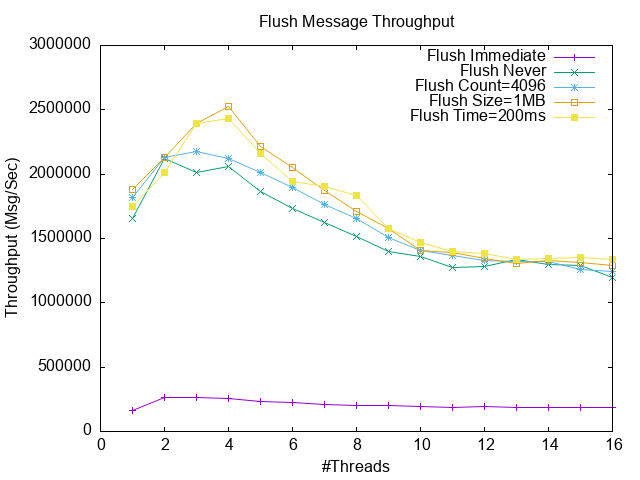
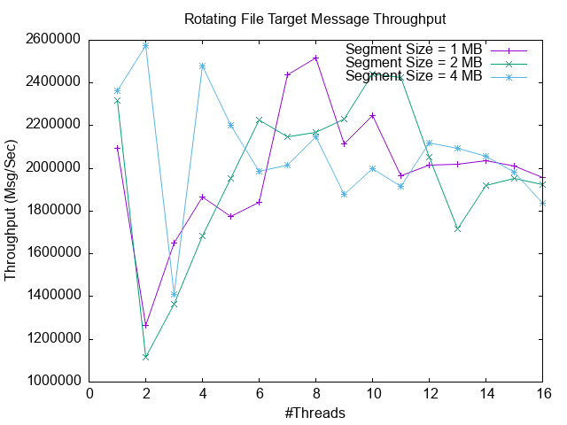

# ELog Logging Library

ELog (Error Log) is a comprehensive, high-performant and feature-rich C++ logging framework.  
Special attention was given to usability, so that developers can easily achieve much with just very few lines of code.  
The library has predefined connectors for various widely-used external systems, and was designed such that it can be extended for a broad range of use cases. In addition, it is fully configurable from file or string input (see examples below).

The project is still in pre-Beta phase, and more is expected to come.

## Basic Examples

Simple [logging macros](#logging-macros):

    ELOG_INFO("App starting");
    ELOG_INFO("This is an unsigned integer %u and a string '%s'", 5, "hi");

Possible output:

    2025-07-05 10:35:18.311 INFO   [32680] This is an unsigned integer 5 and a string 'hi'

Using [fmtlib](https://github.com/fmtlib/fmt) formatting style (requires enabling fmtlib extension):

    ELOG_FMT_INFO("This is an unsigned integer {} and a string '{}'", 5, "hi");

Using binary logging (fmtlib-style only, no formatting takes place in macro):

    ELOG_BIN_INFO("This message is not formatted at all during this call, param {}, param , param {}, 2, true, "some string param");

Using binary logging with format message caching (fmtlib-style only):

    ELOG_CACHE_INFO("This format message cached and referred by id, instead of being copied, param {}, param , param {}, 2, true, "some string param");

Logging with a designated [logger](#defining-log-sources-and-loggers) (error checking omitted):

    // initialize a thread-safe shared logger
    elog::ELogSource* logSource = elog::defineLogSource("core");
    elog::ELogLogger* logger = logSource->createSharedLogger();

    // user logger with ELOG_xxx_EX macro family:
    ELOG_INFO_EX(logger, "Obtained a logger from source %s with id %u",
            logSource->getQualifiedName(), 
            logSource->getId());

Initialize elog and configure an asynchronous (based on lock-free ring-buffer) rotating file log target, having log segment size 4M, and 20 log segments at most:

    elog::initialize();
    elog::configureLogTarget(
        "async://quantum?quantum_buffer_size=1000 | "
        "file:///./app.log?file_segment_size=4mb&file_segment_count=20");

    // all log messages are now directed to the asynchronous rotating logger
    ELOG_INFO("App starting");

When stack traces are enabled (build ELog with ELOG_ENABLE_STACK_TRACE=ON), a stack trace containing file and line can be written to log (voluntarily, not necessarily within exception handler, and no thread context is required):

    ELOG_STACK_TRACE_EX(logger, elog::ELEVEL_INFO, "", 0, "Testing current thread stack trace");

Sample output (Linux):

    2025-07-07 09:53:14.816 INFO   [46748] {main} <elog_root> [Thread 46748 (0xb69c) <main> stack trace]
 
    0# 0x716a4879e618 dbgutil::printStackTraceContext() +185   at dbg_stack_trace.cpp:185 (libdbgutil.so)
    1# 0x716a4903b8cf dbgutil::printStackTrace() +46           at dbg_stack_trace.h:238 (libelog.so)
    2# 0x716a4903b1c1 elog::logStackTrace() +101               at elog.cpp:1527 (libelog.so)
    3# 0x5c4bddcbfb30 initRecovery() +973                      at waL_test.cpp:299 (wal_test_linux)
    4# 0x5c4bddcbeb04 testLoadWALRecord() +120                 at waL_test.cpp:122 (wal_test_linux)
    5# 0x5c4bddcbe96d runTest() +51                            at waL_test.cpp:95 (wal_test_linux)
    6# 0x5c4bddcbe8da main() +389                              at waL_test.cpp:74 (wal_test_linux)
    7# 0x716a4842a1ca N/A                                      at <N/A>  (libc.so.6)
    8# 0x716a4842a28b __libc_start_main()                      at <N/A>  (libc.so.6)
    9# 0x5c4bddcba745 _start() +37                             at <N/A>  (wal_test_linux)

It is also possible to dump stack trace of all running threads, as in pstack (experimental):

    ELOG_APP_STACK_TRACE_EX(logger, elog::ELEVEL_INFO, "", 0, "Testing application stack trace");

See [below](#appendix-a-sample-full-application-stack-trace) for sample output.

In this example, the [log line format](#configuring-log-line-format) can be configured:

    elog::configureLogFormat("${time} ${level:6} [${tid}] ${src} ${msg}");

The effect is the following line format:

- time stamp
- followed by log level aligned to the left using width of 6 characters
- followed by thread id, log source name and log message

This final examples adds an asynchronous log target to send log lines to Grafana-Loki, with following configuration:

    elog::configureTargetFromStr(
        "async://quantum?quantum_buffer_size=1000&log_level=ERROR | "
        "mon://grafana?mode=json&"
        "loki_endpoint=http://192.168.108.111:3100&"
        "labels={app: ${app}}&"
        "log_line_metadata={log_source: ${src}, thread_name: ${tname}}&"
        "stack_trace=yes&"
        "flush_policy=((count == 100) OR (time == 5000ms))");

The log target is configured with the following properties:

- Asynchronous logging (lock-free, ring buffer size is 1000)
- Restrict log shipping to ERROR log level
- Flush (i.e. send HTTP message with accumulated log lines) each 100 log lines or 5 seconds
- Use global log line format for reported log lines
- Use default HTTP client configuration:
    - Retry resend failed message every 5 seconds, when Loki is down
    - Use backlog of 1 MB of data (after which old log data is discard while Loki is down)

Each log line is accompanied by:

- "app" label, which equals to configured application name (see [field reference tokens](#log-record-field-reference-tokens) for more details)
- Log line metadata, containing the log source and thread name issuing the log message
- Logging thread's fully resolved call stack with function/file/line data for each frame

## Features

The ELog library provides the following notable features:

- High performance
    - Although perhaps not the fastest out there, ELog still provides very high performance logging with low overhead
    - Minimal formatting on logging application side, possibly combined with lock-free asynchronous logging
    - Full formatting takes place on background thread
    - **130 nano-seconds latency** using Quantum log target (asynchronous lock-free ring buffer, **scalable** in multi-threaded scenarios), coupled with binary, pre-cached logging
    - Check out the [benchmarks](#benchmarks) below
- Synchronous and asynchronous logging schemes
    - Synchronous logging to file, allowing for efficient buffering and log rotation/segmentation
    - **Lock-free** synchronous log file rotation/segmentation (no performance "hiccups" during segment switch)
- Optimized logging macros
    - If log level does not enable, then no argument evaluation takes place
    - With normal logging macros, only partial message formatting takes place on caller's side
- Structured Logging
    - With configurable log line format, structured logging is supported (e.g. JSON or any user-defined format)
- Binary logging macros
    - Allow performing entire formatting on logging end (fmtlib-style only)
    - Significant impact when complex formatting is used
    - Extendible for supporting user-defined types
- Format message caching macros
    - Allow further optimizing, by avoiding copying format message to binary log buffer
    - Huge impact with long format messages
    - Combined with lock-free asynchronous logging, **scalable** top performance can be achieved
- Log once and moderate logging macros
    - Enable logging once (per process or per thread) a single logging instance
    - Enable moderate logging (rate limiting) a single logging instance
- Logging macros flexibility
    - It is possible to choose at each logging instance whether to use normal, binary or cached logging
    - No special configuration required
    - No predefined message file required
- Full Call Stack Dumping (**with function, file and line information**)
    - Out of the box, depends on [dbgutil](https://github.com/oa-333/dbgutil)
    - Supported platforms: Windows, Linux, MinGW
    - Voluntary current thread call stack dumping (i.e. not in signal handler, so no thread context pointer required)
    - Voluntary full application call stack dumping (i.e. stack trace of all active threads)
- Exception/Crash Handling
    - Out of the box, depends on [dbgutil](https://github.com/oa-333/dbgutil)
    - Writes to log full exception information, including call stack with function, file and line information
    - Generates core dump (mini-dump file on Windows)
- Life-Sign and Post-Mortem Support
    - Redirect occasional log messages to shared memory segment
    - Inspect shared memory of crashed processes
- Wide range of predefined log targets (i.e. "log sinks/appenders"):
    - stdout, stderr
    - syslog, Windows event log
    - log file (including rotation/segmentation)
    - databases ([PostgreSQL](#connecting-to-postgresql), [SQLite](#connecting-to-sqlite), [MySQL](#connecting-to-mysql-experimental))
    - message queues ([Kafka](#connecting-to-kafka-topic))
    - RPC endpoints ([gRPC](#connecting-to-grpc-endpoint))
    - monitoring tools ([Grafana Loki](#connecting-to-grafana-loki), [Datadog](#connecting-to-datadog), [Sentry](#connecting-to-sentry))
- Flexible and rich in features
    - User can define multiple log targets
    - Combine with complex filtering schemes and flush policies
    - Possibly employing rate limiting
    - Can group several log targets under one framework and apply common restrictions and properties
- Pre-initialization Logging
    - Accumulates log messages issued during static initialization (or any message before the ELog library is initialized) and issues the accumulated log messages in each added log target.
- Configurability
    - The entire library is **fully configurable** from file or string, including very complex scenarios (see [basic examples](#basic-examples) above)
    - The purpose is to reduce amount of boilerplate code required just to get things started
    - The following can be configured by file or string:
        - log levels
        - output destinations (log targets/sinks)
        - log file buffering and rotation
        - asynchronous logging schemes
        - formatting patterns, including fonts, colors and conditional formatting
        - complex filters
        - complex flush policies
        - log source hierarchy (file only)
        - log level, with propagation in the log source hierarchy
        - log target affinity (restricting log sources to specific log targets - file only)
        - rate limiting
    - All configurable parameters can be set either globally and/or per log target
- Extendibility
    - All entities in the library are extendible such that they can also be loaded from configuration (i.e. if you extend the library, there is provision to have your extensions to be loadable from configuration file)
        - log targets
        - flush policies
        - log record filters
        - log record formatting
        - log record field reference tokens
    - This requires static registration, which is normally achieved through helper macros
- Various formatting styles
    - Supports both printf and fmtlib formatting style
- Multiple platform support
    - **Linux, Windows, MinGW**
- Intuitive API
    - Most common tasks are achieved via powerful configuration abilities, and using the logging macros
- Extensive Documentation
    - Below you can find a clear and elaborate explanation on how to use, configure and extend the ELog library

### Planned/considered future features:

- Automated periodic configuration reloading and updating log levels
- Connectivity to external TCP/UDP receiver
- Inverse connector with TCP/UDP server and multicast publish beacon (for embedded systems with no IP known in advance)
- Shared memory log target with separate child logging process (for instrumentation scenarios where opening log file is not allowed)
- Logging hub framework for log pre-processing before shipping to server analysis (offload to edge compute)
- Support on MacOS

## Common Use Cases

### Logging Library

The most common use case is a utility logging library, in order to write log messages to file, but much more can be done with it.  
For instance, it can be rather easily extended to be hooked to an external message queue, while applying complex message filtering and transformations. One such extension, namely Kafka Connector, is already implemented built-in.  
This could be useful for DevOps use cases.

### Log Flooding

One more use case is a bug investigation that requires log flooding.  
In this case, sending messages to a log file may affect application timing and hinder bug reproduction during heavy logging.  
For such a situation there is a specialized log target (ELogQuantumTarget), which is designed to minimize the logging latency, by using a lock-free ring buffer and a designated background CPU-bound thread that logs batches of log messages.  
Pay attention that simply using a queue guarded by a mutex is not scalable (check out the [benchmark](#multi-threaded-asynchronous-file-log-target-comparison) below).

### External Systems Connectivity

The ELog system also allows directing log messages to several destinations, so tapping to external log analysis tools, for instance, in addition to doing regular logging to file, is also rather straightforward.  
See [dependencies](#external-dependencies) below for a comprehensive list of external systems integrated with elog out of the box.

### Library Development

One more use case is when developing infrastructure library which requires logging, but the actual logging system
that will be used by the enclosing application is not known (and cannot be known).
In this case, the ELog can be used to log messages inside the library, and the using application may configure
the ELog system to redirect and adapt library log message to its own logging system.
This can be done actually quite easily and with much flexibility.

For more information, see [documentation](#documentation) below.

## Getting Started

In order to use the library, include the main header "elog.h", which is the library facade.  
In the application code, make sure to call one of the elog::initializeXXX() functions before using any of the logging macros. After this, you can use ELOG_INFO() and the rest of the macros.  
At application exit make sure to call elog::terminate().

### External Dependencies

The ELog system has no special dependencies, unless connecting to one of the external systems listed above.
In particular the following compile/runtime dependencies exist in each case:

- Kafka connector requires librdkafka.so
- PostgreSQL connector requires libpq.so
- SQLite connector requires libsqlite3.so
- MySQL connector requires mysqlcppconn.lib for compile and mysqlcppconn-10-vs14.dll for runtime (Windows only)
- gRPC connector depends on gRPC and protobuf libraries
- Grafana/Loki and Datadog connectors requires json/nlohmann and httplib
- Sentry connector requires the Sentry native library
- Stack trace logging and exception/crash handling requires [dbgutil](https://github.com/oa-333/dbgutil)
- fmtlib formatting style requires [fmtlib](https://github.com/fmtlib/fmt)

### Installing

The library can be built and installed by running:

    build.sh --install-dir <install-path>
    build.bat --install-dir <install-path>

(Checkout the possible options with --help switch).

Add to compiler include path:

    -I<install-path>/elog/include/elog
    
Add to linker flags:

    -L<install-path>/bin -lelog

For CMake builds it is possible to use FetchContent as follows:

    FetchContent_Declare(elog
        GIT_REPOSITORY https://github.com/oa-333/elog.git
        GIT_TAG v0.1.0
    )
    FetchContent_MakeAvailable(elog)
    target_include_directories(
        <your project name here>
        PRIVATE
        ${elog_SOURCE_DIR}/src/elog/include
    )
    target_link_libraries(<your project name here> elog)

According to requirements, in the future it may be uploaded to package managers (e.g. vcpkg).

## Help

See [documentation](#Documentation) section below, and documentation in header files for more information.

## Authors

Oren A. (oa.github.333@gmail.com)

## License

This project is licensed under the Apache 2.0 License - see the LICENSE file for details.

# Documentation

## Contents
- [Basic Usage](#basic-usage)
    - [Initialization and Termination](#initialization-and-termination)
    - [Log Levels](#log-levels)
    - [Log Formatting Styles](#log-formatting-styles)
    - [Logging Macros](#logging-macros)
    - [Log Sources and Loggers](#log-sources-and-loggers)
    - [Log Level Propagation](#log-level-propagation)
    - [Log Line Format](#log-line-format)
    - [Log Record Field Reference Tokens](#log-record-field-reference-tokens)
    - [Log Targets](#log-targets)
    - [Configuration Styles](#configuration-styles)
    - [Flush Policy](#flush-policy)
    - [Filtering Log Messages](#filtering-log-messages)
    - [Limiting Log Rate](#limiting-log-rate)
    - [Enabling ELog Internal Trace Messages](#enabling-elog-internal-trace-messages)
    - [Binary Logging](#binary-logging)
    - [Cached Logging](#cached-logging)
    - [Once Logging](#once-logging)
    - [Moderated Logging](#moderated-logging)
    - [Every-N Logging](#every-n-logging)
    - [Life Sign Management](#life-sign-management)
- [Configuration](#configuring)
    - [Configuration Units](#configuration-units)
    - [Configuring Log Level](#configuring-log-level)
    - [Configuring Log Targets](#configuring-log-targets)
    - [Individual Log Target Configuration](#individual-log-target-configuration)
    - [Configuring Flush Policy](#configuring-flush-policy)
    - [Configuring Log Filters](#configuring-log-filters)
    - [Configuring Asynchronous Log Targets](#configuring-asynchronous-log-targets)
    - [Configuring Database Log Targets](#configuring-database-log-targets)
    - [Connecting to PostgreSQL](#connecting-to-postgresql)
    - [Connecting to SQLite](#connecting-to-sqlite)
    - [Connecting to MySQL (experimental)](#connecting-to-mysql-experimental)
    - [Connecting to Kafka Topic](#connecting-to-kafka-topic)
    - [Connecting to gRPC Endpoint](#connecting-to-grpc-endpoint)
    - [Connecting to Grafana-Loki](#connecting-to-grafana-loki)
    - [Connecting to Datadog](#connecting-to-datadog)
    - [Connecting to Sentry](#connecting-to-sentry)
    - [Nested Specification Style](#nested-specification-style)
    - [Terminal Text Formatting](#terminal-text-formatting)
    - [Terminal Text Formatting Syntax](#terminal-formatting-formal-syntax-specification)
- [Extending The Library](#extending-the-library)
    - [Extending The Formatting Scheme](#extending-the-formatting-scheme)
    - [Supporting User-Defined Types in Binary Logging](#supporting-user-defined-types-in-binary-logging)
    - [Adding New Log Filter Types](#adding-new-log-filter-types)
    - [Adding New Flush Policy Types](#adding-new-flush-policy-types)
    - [Adding New Log Target Types](#adding-new-log-target-types)
    - [Adding New Schema Handler Types](#adding-new-schema-handler-type)
    - [Using Proprietary Protocol for gRPC Log Target](#using-proprietary-protocol-for-grpc-log-target)
- [Benchmarks](#benchmarks)
    - [Benchmark Highlights](#benchmark-highlights)
    - [Empty Logging Benchmark](#empty-logging-benchmark)
    - [Synchronous File Log Target with Count Flush Policy](#synchronous-file-log-target-with-count-flush-policy)
    - [Synchronous File Log Target with Size Flush Policy](#synchronous-file-log-target-with-size-flush-policy)
    - [Synchronous File Log Target with Time Flush Policy](#synchronous-file-log-target-with-time-flush-policy)
    - [Single-threaded Synchronous File Log Target Comparison](#single-threaded-synchronous-file-log-target-comparison)
    - [Multi-threaded Asynchronous File Log Target Comparison](#multi-threaded-asynchronous-file-log-target-comparison)
- [Appendices](#appendices)
    - [Appendix A: Sample Full Application Stack Trace](#appendix-a-sample-full-application-stack-trace)

## Basic Usage

### Initialization and Termination

The ELog library can be used out of box as follows:

    #include "elog.h"
    ...

    int main(int argc, char* argv[]) {
        // initialize the elog system to log into file
        if (!elog::initializeLogFile("./test.log")) {
            fprintf(stderr, "Failed to initialize elog\n");
            return 1;
        }

        // do application stuff
        ELOG_INFO("App starting");
        ...

        // terminate the elog system
        elog::terminate();
        return 0;
    }

The example exhibits the main parts of the ELog library:

- Including the ELog library's main facade header "elog.h"
- Initialization (in this case using a log file)
- Invoking the logging macros
- Termination

There are several initialization functions, which can all be found in the ELogSystem facade.
In this example a synchronous segmented log file is used, with 4MB segment size:

    #include "elog.h"
    ...
    
    #define MB (1024 * 1024)

    int main(int argc, char* argv[]) {
        // initialize the elog system to log into segmented file
        if (!elog::initializeSegmentedLogFile(
                ".",        // log dir
                "test",     // segment base name
                4 * MB)) {  // segment size
            fprintf(stderr, "Failed to initialize elog\n);
            return 1;
        }

        // do application stuff
        ELOG_INFO("App starting");
        ...

        // terminate the elog system
        elog::terminate();
        return 0;
    }

### Log Levels

The following table summarizes the supported log levels in their intended meaning:

| Log Level | Meaning |
| -- | -- |
| FATAL | Fatal error occurred, program cannot continue |
| ERROR | Operation failed, program can continue |
| WARN | Something went wrong, operation can finish |
| NOTICE | Something requires user attention, probable API misuse, operation can finish |
| INFO | Informational message, reporting application state, operation progress, etc., not frequent |
| TRACE | Used for debugging purposes, low frequency printing |
| DEBUG | Used for debugging purposes, high frequency printing |
| DIAG | Used for debugging purposes, expected log flooding |

### Log Formatting Styles

Currently ELog supports two main log formatting styles:

- printf style
- fmtlib style (requires building ELog with ELOG_ENABLE_FMT_LIB=ON)

According to need, C++ stream style may be supported as well, with insertion operator overloading, and that is solely for the purpose of smooth migration from old logging systems, as performance is known to be slow with this style of log message formatting. 

### Logging Macros

ELog utilizes logging macros for efficient logging, such that when the logged message is not to be issued (e.g. due to insufficient log level or some global filter), then no macro argument evaluation, nor any message formatting takes place at all.

All Elog logging macros start with the prefix "ELOG_", followed by logging method designator (see below), followed by log level, and an optional "_EX" suffix when a logger is used.

The ELog framework defines 5 groups of utility macros, each for a different method of logging:

- Normal logging macros (starts with "ELOG_")
    - Initial formatting takes place on caller's context (even when using asynchronous logging)
- fmtlib-style logging macros (starts with "ELOG_FMT_")
- [binary logging macros](#binary-logging) (starts with "ELOG_BIN_")
- [binary auto-cached logging macros](#cached-logging) (starts with "ELOG_CACHE_")
- [binary pre-cached logging macros](#cached-logging) (start with "ELOG_ID_")

The easiest form of logging is without any logger defined (no "_EX" suffix):

    ELOG_INFO("Sample message with string parameter: %s", someStr);

In order to specify a logger, use the _EX() suffix, as follows:

    ELOG_WARN_EX(logger, "Sample message with string parameter: %s", someStr);

Or:

    ELOG_FMT_WARN_EX(logger, "Sample message with string parameter: {}", someStr);

See [log sources and loggers](#log-sources-and-loggers) for more information on how a logger can be obtained.

Note that in case that the log message is to be issued, then normally, only partial logging takes place at the caller's context (just the log message, without formatting any time, logger name, module, thread id, etc.), and the rest of the formatting takes place at a later phase. This means that in case of asynchronous logging, part of the formatting takes place on another context. This can be further optimized with [binary logging](#binary-logging) and [cached logging](#cached-logging).

### Configuring Log Levels

TBD: this needs to be edited

There is no global log level configuration, for two main reasons:

- Using such a "central valve" may cause performance degradation in heavy multi-threaded scenarios
- If such a global log level restriction exists, then how it should be combined with log level at the log source?
    - If we require to choose the more restrictive level, then configuring log level of log sources is meaningless,  
    since we would have to configure the global log level as well (for instance in DEBUG)
    - If we choose the less restrictive level, then we don't need a global log level at all, and the log level  
    of the log source suffices to decide whether to allow to log the message or not

For these reasons, log levels can be specified at the log source:

- elog::ELogSource::setLogLevel()

See [log level propagation](#log-level-propagation) below for more details.

NOTE: Regardless of the above, a "main valve" is defined in each log target, but is normally totally loose.  
For more details please refer to [log targets](#log-targets).

### Log Sources and Loggers

One of the main entities in the ELog system is the Log Source.  
The log source serves as a semantic module entity.  
It assists in organizing log messages, by allowing to specify from where the message came.

From one Log Source many loggers can be obtained, one for each logging class/file.
A logger is the logging client's end point, with which log messages are partially formatted,  
before being sent to log targets for actual logging.

Here is a simple example of defining a log source and obtaining a shared logger:

    elog::ELogLogger* logger = elog::getSharedLogger("core");
    if (logger == nullptr) {
        // NOTE: we use here the default logger, which is always defined
        ELOG_ERROR("Failed to define log source with name core");
    } else {
        ELOG_INFO_EX(logger, "Obtained a shared logger from source %s with id %u",
            logger->getLogSource()->getQualifiedName(), 
            logger->getLogSource()->getId());
    }

Log sources form a tree hierarchy according to their qualified name, which is separated by dots.  
The root log source has an empty name, and does not have a dot following its name, so that second level  
log sources have a qualified name that is equal to their bare name.  

The module name for a log source is set by default to the qualified name of its parent log source.  
So if the log source's qualified name is "core.files", its module name is "core".
The module name can be modified as follows:

    elog::ELogLogger* logger = elog::getSharedLogger("core.files");
    if (logger != nullptr) {
        logger->getLogSource()->setModuleName("infra");
    }

Pay attention that the default logger will emit "elog_root" for log source name, and "elog" for module name.

### Log Level Propagation

The log level of each log source may be controlled either individually, or in a way such that it affect  
all log sources underneath it.  
For instance, suppose the following log source hierarchy is defined:

    core
    core.files
    core.thread
    core.net

The core log source may define log level of NOTICE, but the core.thread log level may define log level DEBUG.  
Suppose we want to reduce the log level of "core" log source to TRACE, such the all loggers underneath it will  
also be configured with level TRACE. This is one use case.  

Now suppose we want to reduce the log level of core log source to TRACE, such the all loggers underneath it will  
also be configured with level TRACE, but this time, if there is a logger with a lower log level (say DEBUG),  
it will not be affected.  

The final use case is where would like to restrict log level of the "core" log source to WARN, and have all  
log sources underneath it also be configured with level ERROR, unless it already has a more restrictive log  
level (say FATAL).

In order to enable better granularity of control over the log level of the log source hierarchy, the log source  
provides the setLogLevel() method, which allows specifying how to propagate the log level to child log sources:

    void setLogLevel(ELogLevel logLevel, ELogPropagateMode propagateMode);

In particular there are 4 propagation modes, corresponding to the use cases presented above:

- none: No log level propagation takes place at all, only the configured log source is affected.
- set: Each descendant log source inherits the log level of the log source ancestor
- restrict: Each descendent log source cannot have less restrictive log level than the log source ancestor
- loose: Each descendent log source cannot have more restrictive log level than the log source ancestor

This allows for more flexibility in configuring the log source tree.

### Log Line Format

The ELog system allows configuring log line format using a format specification string  
that supports special log record field reference tokens.  
For instance, the default log line format specification that is used by ELog is:

    ${time} ${level:6} [${tid}] ${msg}

In code, it can be done as follows:

    elog::configureLogFormat("${time} ${level:6} [${tid}] ${msg}");

In configuration (globally or per log target), it can be done as follows:

    log_format=${time} ${level:6} [${tid}] ${msg}

This format in reality gets expanded to something like this:

    2025-04-08 11:40:58.807 INFO   [49108] Thread pool of 10 workers started

We see here all 4 components expanded:

- logging time
- log level (aligned to the left with width of 6 characters)
- logging thread id, enclosed with brackets
- formatted log message

Following is a specification of all predefined log record field reference tokens.  
This list may be extended by the library user.

### Log Record Field Reference Tokens

The following special log record field reference tokens are understood by the ELog library:

- ${rid} - the log record id (unique per thread).
- ${time} - the logging time.
- ${host} - the host name.
- ${user} - the logged in user.
- ${os_name} - the operating system name.
- ${os_ver} - the operating system version.
- ${app} - configurable application name (requires user collaboration).
- ${prog} - the program name (extracted from executable image file name).
- ${pid} - the process id.
- ${tid} - the logging thread id.
- ${tname} - the logging thread name (requires user collaboration).
- ${level} - the log level.
- ${file} - The logging file name.
- ${line} - The logging line.
- ${func} - The logging function.
- ${src} - the log source of the logger (qualified name).
- ${mod} - the module name associated with the log source.
- ${msg} - the log message.

Reference tokens may contain justification number, where positive means justify to the left,  
and negative number means justify to the right. For instance: ${level:6}, ${tid:-8}.

Log record field reference tokens may be specified in several places in the configuration file:

- log line format
- log filters
- attributes passed to external systems (monitoring tools, message queues, databases, etc.)

An extended syntax for reference token was defined for special terminal formatting escape sequences (colors and fonts).
See [terminal text formatting](#terminal-text-formatting) for more details.

### Log Targets

Log targets are where log records are sent to after being optionally partially formatted (and filtered).  
Each log target usually performs final formatting (which may be different in each log target),  
and writes the formatted log message to some destination (e.g. file).  

Although there is API in place, it is most convenient to configure log target by URL strings.  
For instance, a simple log file target can be defined as follows:

    elog::configureLogTarget("file:///./app.log");

In the same manner a rotating log file can be defined:

    elog::configureLogTarget("file:///./app.log?file_segment_size=4mb&file_segment_count=20");

This defines a total of at most 20 log segments, each having at most 4 MB of log data.  
The segment size restriction is not a hard limit, and at times of load this limit may be slightly breached.  

File buffering may be specified to optimize I/O as follows:

    elog::configureLogTarget("file:///./app.log?file_buffer_size=4096");

Pay attention that whatever can be achieved through configuration by string, can also be configured from file.

The above can be achieved programmatically, if required, through exposed APIs:

    - elog::addLogFileTarget()
    - elog::addStdErrLogTarget()
    - elog::addStdOutLogTarget()
    - elog::addSysLogTarget()
    - elog::addWin32EventLogTarget()

Once a log target is configured, it will receive all logged messages, unless log level does not allow,  
or there is some other restrictive [filter](#filtering-log-messages) on the way.

Several aspects of the log target can be configured through the URL string for any target:

- log level
- log filter
- flush policy
- rate limiting
- log line format
- name

These are common aspects of all targets, but their meaning may vary sometimes.  
For instance, the flush policy determines when to flush a file when using a file log target,  
but when using a monitoring tool log target (e.g. Grafana Loki), the flush policy actually determines  
when to send log data through the HTTP client. Implied by that also is the amount of log data aggregated  
in the HTTP message payload.

Be advised that configuring these aspects programmatically can result in a lot of code,  
so it might be simpler to use configuration URL strings instead.  
Check out the [configuration](#configuring-from-file-or-string) section for more details on how quite  
complex log target configuration can be achieved with a one-liner URL string.

For more elaborate details on how to configure log targets, please refer to [this](#configuring-log-targets) section.

### Configuration Styles

In the following sections, several configuration styles may be referred.  
The purpose is to let the user choose what he prefers.  
In particular, the following configuration styles are used:

- URL string
    - a string in URL-like form, with some modified and permissive syntax
    - used only for configuring log target in a configuration file or by a string
- Nested style
    - when URL strings become too complex, it is possible to specify them in nested form
    - This is very similar to a permissive JSON format
- Expression Predicate Style
    - As flush policies and filter may become quite complex, the URL (or the nested form) gets bloated, so it is possible to specify filters and flush policies in a free-style form
    - Some filter cannot be specified in any other way
    - This form is distinguished by being enclosed with parenthesis
    - It has the form of a predicate, usually being used in conjunction with AND/OR/NOT operators
    - Can be specified within URLs or nested form specification

### Flush Policy

As some log targets may require flushing (as in file, or any buffered channel), a policy can be defined.  
By default, all log targets do NOT flush after each message logging.  
The following flush policies are pre-defined by the ELog library:

- none (no flush policy defined, use default behavior currently defined in ELog)
- immediate (flush after each logged message)
- never (never flush, rely on transport layer to manage itself)
- count (flush after a configured amount of messages has been logged)
- size (flush after a configured amount of messages data has been logged)
- time (flush after a configured amount time has passed)

For instance, the following URL string defined flush every 5 log messages:

    log_target = file:///./app.log?flush_policy=count&flush_count=5

The same can be achieved with more convenient free-style predicate form:

    log_target = file:///./app.log?flush_policy=(count == 5)

Flush policies are defined on a per-target basis, and there is no global flush policy defined.  
For more details on how to configure flush policies, please refer to [this](#configuring-flush-policy) section.

### Filtering Log Messages

By default, all messages are logged, unless log level does not permit, as configured by each log source.  
There are some occasions that a more fine-grained filtering is required.  
In that case a log filter may be configured, and that may be done either globally or per log target.  

The log filters predefined by ELog relate to log record fields, and apply some comparator to them:

    log_target = file:///./app.log?filter=(log_module != core)

The above example allows all message to be passed to the file log target, except for messages originating from the "core" module. Other log targets are not affected by this filter.  

Note that the [configuration style](#configuration-styles) above uses expression predicates.  
The same can be achieved programmatically as follows:

    ELogFilter* filter = new ELogModuleFilter("core", ELogCmpOp::CMP_OP_NE);
    logTarget->setLogFilter(filter);

For more details on how to configure log filter, refer to [this](#configuring-log-filters) section.

### Limiting Log Rate

A special instance of a log filter is the rate limiter, which may be applied globally or per log-target:

    // no more than 500 messages per second
    elog::ELogRateLimiter* rateLimiter = new elog::ELogRateLimiter(500);
    elog::setLogFilter(rateLimiter);

In configuration, the following expression syntax may be used:

    log_target = file:///./app.log?filter=(rate_limit == 500)

Alternatively, the normal configuration style can be used:

    log_target = file:///./app.log?filter=rate_limit&max_msg_per_sec=500

### Enabling ELog Internal Trace Messages

It is possible to enable trace messages for ELog through the environment variable ELOG_REPORT_LEVEL.  
Basically, all internal error/trace reporting is redirected to the installed report handler, which is normally set during library initialization (see elog::initialize()). If not report handler is installed by the user, then by default ELog uses an internal logger, which emits report to the standard error stream (in faint font).

Whether externally set by user, or internally used by ELog, the default log level for all internal reports redirected to the report handler is WARNING. This value can be controlled externally by the environment variable ELOG_REPORT_LEVEL, ot it can be controlled programmatically through the elog::setReportLevel() API.

If report level is set to INFO, then while stopping a log target, its internal statistics report summary in printed (unless statistics was disabled for the log target). Here is a sample report:

2025-07-25 09:56:21.702 INFO   [35484] elog_root Log target statistics during stop:
    Statistics for log target async/elog_bench:
            Log messages discarded: 0
            Log messages submitted: 1000003
            Log messages written: 1000003
            Log messages failed write: 0
            Bytes submitted: 0
            Bytes written: 0
            Bytes failed write: 0
            Flush requests submitted: 0
            Flush requests executed: 0
            Flush requests failed execution: 0
            Flush requests discarded: 0
    sub-target statistics (log target: file/):
            Log messages discarded: 0
            Log messages submitted: 1000003
            Log messages written: 1000003
            Log messages failed write: 0
            Bytes submitted: 79889111
            Bytes written: 79889111
            Bytes failed write: 0
            Flush requests submitted: 0
            Flush requests executed: 0
            Flush requests failed execution: 0
            Flush requests discarded: 0
            Buffer write count: 76
            Average buffer size: 1048559 bytes

### Binary Logging

Normally, when a log message is issued, only partial log formatting takes place at the caller's context (just the log message, without formatting any time, logger name, module, thread id, etc.), and the rest of the formatting takes place at a later phase, according to the log line format of each target. This means that in case of asynchronous logging, part of the formatting takes place on another context. This can be optimized with binary logging.

Binary logging means that format string parameters are serialized into a buffer, such that no formatting takes place at all on the caller's context. Instead when the user's message is formatted at a later phase, all parameters are deserialized and then string formatting takes place. This is possible only with fmtlib formatting style.

In order to use binary logging, no special configuration is needed, except for building ELog with fmtlib support (pass to cmake build ELOG_ENABLE_FMT_LIB=ON, or use build script with parameter --fmt-lib). After that, binary logging macros can be used as follows:

    ELOG_BIN_INFO("This is a test binary message, with int {}, bool {} and string {}", (int)5, true, "test string param");

The format string and the parameters are serialized into a buffer, to be later deserialized and used for formatting the log message. If asynchronous logging is used, then no formatting takes place at all on the caller's context.

Check out the [benchmarks](#binary-logging-and-format-message-caching) below that demonstrates the acceleration of binary logging depending on the number of parameters being used in the format string. Binary logging is a good choice when the number of parameters is rather high, in which case normal formatting is not scalable.

### Cached Logging

Cached logging adds another layer of optimization to binary logging, and saves the step of copying the format string to a binary buffer, and instead caches it in a global cache (lock free hash table). So instead of serializing a format string, only a cache entry id (4 bytes integer) is serialized. Cached logging can be used as follows:

    ELOG_CACHE_INFO("This is a test binary auto-cached message, with int {}, bool {} and string {}", 
        (int)5, true, "test string param");

What happens behind the scenes is that the format string is cached during the first invocation of the logging macro, and any subsequent access to the log macro will use the cached id of the format message.

Cached logging can take place either automatically, using the ELOG_CACHE_XXX() macro set, or alternatively, the format messages can be cached in advance (which is slightly faster), in which case, a different macro should be used:

    // cache format message in advance
    elog::ELogCacheEntryId msgId = elog::getOrCacheFormatMsg(
        "This is a test binary pre-cached message, with int {}, bool {} and string {}");

    // log with cached message id
    ELOG_ID_INFO(msgId, (int)5, true, "test string param");

Check out the [benchmarks](#binary-logging-and-format-message-caching) below that demonstrates the acceleration of cached logging depending on the number of parameters being used in the format string, and the length of the format string. When format string length is rather long, cached logging is scalable, and demonstrates high performance.

### Once Logging

In cases of possible log flooding (i.e. repeated error), it is possible to avoid such conditions with once-logging:

    if (failed) {
        ELOG_ONCE_ERROR_EX(logger, "Failed to write to file: %s", fileName);
    }

This can be applied also at the thread level:

    if (failed) {
        ELOG_ONCE_THREAD_ERROR_EX(logger, "Failed to write to file: %s", fileName);
    }

### Moderated Logging

It may be desired to limit the rate of some log message. This can be done as follows:

    ELOG_MODERATE_INFO_EX(logger, 2, "Passing through here many times, but logging is restricted to only twice per each second");

If [internal ELog reporting](#enabling-elog-internal-trace-messages) is enabled, and set to level INFO, then some discarding/aggregation statistics are printed. For instance, consider this example:

    for (uint32_t i = 0; i < 30; ++i) {
        ELOG_MODERATE_INFO(2, "This is a test moderate message (twice per second)");
        std::this_thread::sleep_for(std::chrono::milliseconds(100));
    }

Here is a partial sample output:

    2025-08-04 23:15:46.024 INFO   [45968] <elog_root> This is a test moderate message (twice per second)
    2025-08-04 23:15:46.131 INFO   [45968] <elog_root> This is a test moderate message (twice per second)
    2025-08-04 23:15:47.006 INFO   [45968] <elog> The message 'This is a test moderate message (twice per second)' has been discarded for 7 times in the last 766 milliseconds
    2025-08-04 23:15:47.006 INFO   [45968] <elog_root> This is a test moderate message (twice per second)
    2025-08-04 23:15:47.114 INFO   [45968] <elog_root> This is a test moderate message (twice per second)
    2025-08-04 23:15:48.098 INFO   [45968] <elog> The message 'This is a test moderate message (twice per second)' has been discarded for 8 times in the last 869 milliseconds

### Every-N Logging

As in other common logging frameworks, another way of limiting the rate of log messages, is by issuing a log message once in every-N messages. This can be done as follows:

    ELOG_EVERY_N_INFO_EX(logger, 20, "Passing through here many times, but logging is restricted to only once per 20 messages");

### Life-Sign Management

ELog supports out of the box life-sign reporting and post-mortem analysis tools. For this ELog needs to be compiled with ELOG_ENABLE_LIFE_SIGN=ON. The main philosophy of life-sign reporting is to be automated as much as possible. The user only needs to configure when and how log records are sent to the life-sign shared memory segment.

Life-sign reporting can be configured for the entire application (such that each log message is checked for life-sign reporting), for the current thread (such that each message in the current thread is checked), or for a specific log source (such that each message originating from the log source is checked, for all threads). In addition, the frequency of life-sign reporting can be configured, such that once in every N messages, the log record is sent to the shared memory segment, or that rate limiting is imposed (only N messages per second are allowed to pass through). Finally, life-sign reports are configured on a per-level basis, so that, for instance, FATAL/ERROR log messages can be always sent to life-sign reporting, and WARN/NOTICE only once in a while.

This is the API for configuring how life sign reports are sent:

    bool setLifeSignReport(ELogLifeSignScope scope, ELogLevel level,
                            const ELogFrequencySpec& frequencySpec,
                            ELogSource* logSource = nullptr);

A previous configuration can be reconfigured, or removed altogether with the following API:

    removeLifeSignReport(ELogLifeSignScope scope, ELogLevel level, ELogSource* logSource = nullptr);

The user is free to voluntarily send any text to the life-sign shared memory segment:

    void reportLifeSign(const char* msg);

The format of the log message sent to the life-sign shared memory segment is taken from the global (default) log formatter. This can be changed with the following API:

    bool setLifeSignLogFormat(const char* logFormat);

NOTE: All life-sign configuration APIs are thread-safe and designed for usage during normal operation of ELog, through the usage of a lock-free (atomic RCU pointers) epoch-based garbage collector.

Since on Windows the shared memory object may be out-of-sync with its backing file, it may be required to flush the contents of the sahred memory segment to disk. This can be done manually with:

    bool syncLifeSignReport();

Periodic syncing can be configured with:

    void setLifeSignSyncPeriod(uint32_t syncPeriodMillis);

#### Initializing Life-Sign Reporting

When initializing ELog, the life-sign reporting can be configured via the ELogParams structure. In particular the following members can be used to control how the life-sign reporting is configured:

- m_maxThreads
- m_enableLifeSignReport
- m_lifeSignGCPeriodMillis
- m_lifeSignGCTaskCount

As life-sign reporting is designed for thread-safe configuration during normal operation of ELog, a garbage collector is used for various filters. For this reason the maximum number of threads configuration is crucial. If the number of threads accessing ELog surpasses the configured number of maximum threads, then memory leaks are expected.

Unless configuring life-sign reporting frequently during ongoing ELog operation, there is no need to set m_lifeSignGCPeriodMillis and m_lifeSignGCTaskCount, as they are tuned for infrequent life-sign reporting configuration changes.

It is possible to disable life-sign reporting altogether (even though compiled with ELOG_ENABLE_LIFE_SIGN=ON) by setting m_enableLifeSignReport to false before calling elog::initialize();

#### Inspecting Shared Memory Segments

ELog provides a small utility CLI, called elog_pm for inspecting life-sign shared memory segments of active, terminated and crashed processes that run with life-sign reporting enabled. The CLI can be also operated as a command program (non-interactive).

The elog_pm CLI supports the following commands:

- ls-shm
- dump-shm [shm-name]
- del-shm [shm-name]
- del-all-shm

Following is a sample output of elog_pm console:

    C:\install\bin\Windows-Debug>elog_pm
    ELog Post-mortem CLI, version 0.1

    <elog-pm> $ ls-shm

    Shared memory segment list:
    Name                                                            Size
    dbgutil.life-sign.elog_bench.exe.2025-08-20_10-55-46.12312.shm  71303488 bytes
    dbgutil.life-sign.elog_bench.exe.2025-08-20_10-34-57.21656.shm  71303488 bytes
    dbgutil.life-sign.elog_bench.exe.2025-08-20_10-34-50.24556.shm  71303488 bytes

    <elog-pm> $ dump-shm dbgutil.life-sign.elog_bench.exe.2025-08-20_10-55-46.12312.shm

    Shared memory segment details:
    --------------------------------------------
    Image path:             C:\install\bin\Windows-Debug\elog_bench.exe
    Application name:       elog_bench_app
    Start of run:           2025-08-20 10:55:46
    Process id:             12312
    Context area size:      4194304 bytes
    Life-sign area size:    4194304 bytes
    Last process seen time: 2025-08-20 10:56:09
    Last segment sync time: 2025-08-20 10:56:11
    Is fully synced:        yes
    --------------------------------------------
    Thread id:         6208
    Thread name:       elog_bench_main
    Thread state:      running
    Thread start time: 2025-08-20 10:55:46
    Thread life-sign records:
    1. Test life sign
    --------------------------------------------
    Thread id:         2460
    Thread name:       test-thread-app-0
    Thread state:      terminated
    Thread start time: 2025-08-20 10:55:49
    Thread end time:   2025-08-20 10:55:55
    Thread life-sign records:
    1. 2025-08-20 10:55:49.476 INFO   [2460 ] elog_root This is a life sign log (count 1) from thread 0, with APP filter freq 1
    2. 2025-08-20 10:55:50.476 INFO   [2460 ] elog_root This is a life sign log (count 2) from thread 0, with APP filter freq 1
    --------------------------------------------
    Thread id:         14424
    Thread name:       test-thread-4
    Thread state:      terminated
    Thread start time: 2025-08-20 10:55:56
    Thread end time:   2025-08-20 10:56:02
    Thread life-sign records:
    1. 2025-08-20 10:55:56.239 INFO   [14424] elog_root This is a life sign log (count 1) from thread 4, with THREAD filter freq 2
    2. 2025-08-20 10:55:58.244 INFO   [14424] elog_root This is a life sign log (count 3) from thread 4, with THREAD filter freq 2
    3. 2025-08-20 10:56:00.254 INFO   [14424] elog_root This is a life sign log (count 5) from thread 4, with THREAD filter freq 2
    --------------------------------------------
    Thread id:         10368
    Thread name:       test-log-source-thread-0
    Thread state:      terminated
    Thread start time: 2025-08-20 10:56:02
    Thread end time:   2025-08-20 10:56:07
    Thread life-sign records:
    1. 2025-08-20 10:56:02.280 INFO   [10368] elog_root This is a life sign log (count 1) from thread 0, with LOG-SOURCE rate limit of 5 msg/sec
    2. 2025-08-20 10:56:02.340 INFO   [10368] elog_root This is a life sign log (count 2) from thread 0, with LOG-SOURCE rate limit of 5 msg/sec
    3. 2025-08-20 10:56:02.399 INFO   [10368] elog_root This is a life sign log (count 3) from thread 0, with LOG-SOURCE rate limit of 5 msg/sec

Some points to note:

- When calling elog::setAppName() the application name will be reported in the summary section
- When calling elog::setCurrentThreadName() the name of the thread appears in the thread summary section
- "Last process seen time" (Windows only) can be used to estimate the time of crash
- "Last segment sync time" (Windows only) can be used to understand how up-to-date the segment contents are
- "Is fully synced" (Windows only) can be used to determine whether the ELog Guardian was able to synchronize most recent segment contents to disk
- At the time of crash, the main thread (elog_bench_main, id 6208) was still running
- At the time of crash, the main thread (elog_bench_main, id 6208) was still running, while all other threads already terminated
- Application-scope life-sign reports were configured for every message
- Thread-scope life-sign reports were configured for once in every two log messages
- Log-source-scope life-sign reports were configured for at most 5 messages per second

#### Running The Life Sign Guardian

As mentioned above, on Windows platforms it is crucial to have an external process open another handle to the life-sign shared memory segment, otherwise, if the owning processes crashes, the kernel object of the shared memory segment is closed, and the shared memory segment is lost forever. For this reason a guardian utility was added to ELog.

The Life-Sign Guardian Process can be launched with the following command line:

    elog_pm --shm-guard

The Guardian is available only on Windows, and can have only one instance. Attempting to launch another instance will fail:

    2025-08-20 12:13:13.709 ERROR  [24688] elog_pm Cannot run ELog Life-Sign Guardian, there is already another instance running

## Configuration

The ELog library provides utility functions to load configuration from file or string:

- configureByPropFile (load definitions from property file, key=value)
- configureByProps (load from property map)
- configureByPropFileEx (load from property file, extended position information)
- configureByPropsEx (load from property map, extended position information)
- configureByFile (load from file, nested/permissive JSON format)
- configureByStr (load from string, nested/permissive JSON format)
- configure (load from configuration object)

TODO: refine API, we don't need so many functions

### Configuration Units

The Elog library allows to configure timeout and size with unit specification.  
In particular timeout can be specified as follows (case insensitive, space not required but can be specified):

    flush_timeout = 200ms
    flush_timeout = 200 millis
    flush_timeout = 500 microseconds

The following table summarized the allowed units:

| Unit | Allowed Specification |
| -- | -- |
| seconds | s, second, seconds |
| milliseconds | ms, milli, millis, milliseconds |
| microseconds | us, micro, micros, microseconds |
| nanoseconds | ns, nano, nanos, nanoseconds |

In a similar manner sizes may be specified as follows:

    file_buffer_size = 4096 bytes
    file_buffer_size = 4k
    file_buffer_size = 1mb

The following table summarized the allowed units:

| Unit | Allowed Specification |
| -- | -- |
| bytes | b, byte, bytes |
| kilobytes | k, kb, kilobyte, kilobytes |
| megabytes | m, mb, megabyte, megabytes |
| gigabytes | g, gb, gigabyte, gigabytes |

Pay attention that in the context of flush policy expressions,  
white space between the value and the units (whether timeout or size) is **not** allowed.

### Configuring Log Level

The log level configuration items follow the following syntax:

    <log-level-string><propagation-spec>

The log level string is any one of the following:

    FATAL
    ERROR
    WARN
    NOTICE
    INFO
    TRACE
    DEBUG
    DIAG

The propagation specification could be empty, or any one of the following:

    * (asterisk sign): specifies to propagate the log level as is to all descendant log sources
    + (plus sign): specifies permissive (loose) log level propagation
    - (minus sign): specifies restrictive log level propagation

So, continuing the example above, we can define that the entire core module has INFO log level,  
but the files sub-module will have TRACE log level:

    core.log_level = INFO*
    core.files.log_level = TRACE*

Now suppose that for a short while we would like to investigate some bug in the core module,  
but we would like to avoid setting the files sub-module level to DEBUG, since it is really noisy,  
and it is not related to the bug we are investigating. The simplest way to do this is as follows:

    core.log_level = DEBUG+
    core.files.log_level = TRACE-

The above configuration ensures all core log sources have at least DEBUG log level (if any log source  
had a more permissive log level, then its log level is kept intact), but after that the cores.files  
module log level is restricted to TRACE, including all sub-packages.  
Pay attention that order matters here.

### Configuring Log Targets

As mentioned above, log targets can be configured using properties.  
The following syntax is supported:

    sys://stdout - add log target to standard output stream
    sys://stderr - add log target to standard error stream
    sys://syslog - add log target to syslog (or Windows event log, when running on Windows)
    file://path - add regular log target
    file://path?file_segment_size=<file-segment-size> - add segmented file log target
    db://provider?conn_string=<url>&insert_query=<insert-query>...
    msgq://provider?... (see example below for more details)
    rpc://provider?rpc_server=<host:port>&rpc_call=<function-name>(<param-list>)

Log targets may be assigned a name for identification, if further special configuration is required.  
Target name may be specified by the 'name' parameter, as follows:

    file://path?name=file-logger

Next, the log target may be located as follows:

    elog::ELogTarget* logTarget = elog::getLogTarget("file-logger");

### Individual Log Target Configuration

The log line format and the log level of each target can be configured separately. For instance:

    log_target = sys://syslog?log_level=FATAL&log_format=${level:6} ${prog} ${pid} [${tid}] <${src}> ${msg}
    log_target = sys://stderr?log_level=ERROR&log_format=***ERROR*** ${time} ${level:6} ${msg}

Pay attention that the rest of the log targets will use the global log level and line format configuration.

### Configuring Flush Policy

Log targets can be assigned a flush policy (file targets by default flush after every message).
The flush policy can be configured as follows:

    flush_policy=none|immediate|never|count|size|time

Where each value designates a different policy:

- none: no flushing is specified, behavior is determined by each log target separately
- immediate: orders to flush log target after each log message sending
- never: orders to avoid flushing the log target altogether, except for during shutdown
- count: Order to flush log target after a configured amount of log messages has been sent
- size: Order to flush log target after a configured amount of bytes of log messages has been sent
- time: Order to flush log target after a configured amount of time passed since last flush took place

The last three flush policies require the following addition parameter each respectively:

- flush_count
- flush_size
- flush_timeout

Complex flush policies can be defined with the following free style syntax:

flush_policy=((count == 10) OR (time == 5000))

This is interpreted as flushing either when 10 log messages are accumulated or when timeout from last flush exceeds 5 seconds.  

The following operators are allowed:

- AND
- OR
- NOT
- CHAIN (experimental, used for group flush moderation)

The following flush policies are recognized (can be externally extended):

- count, size, time

Only == (equals) operator is recognized in this context.  
The expression must be properly formed with parenthesis enclosing each sub-expression.

### Configuring Log Filters

Log records can be filtered, such that some log records are dropped due to configured criteria.  
This can take place on a global level or on a per-target basis.  
By default there is no special log filtering except for log level.  
Log filters can be configured inside a log target URL, or using nested form.  
Due to their tendency to be complex, it is highly recommended that free-style expressions be used:

filter=((log_module == files) OR (log_level == FATAL))

This is interpreted as: allow logging only log messages that originate from the "files" module  
or that have a FATAL log level.

The following operators are allowed:

- AND
- OR
- NOT
- CONTAINS (search for substring)
- LIKE (regular expression matching)
- <, <=, >, >=, ==, != (integer/string/time/level comparison)

The following filter names are recognized (can be externally extended):

- record_id, record_time, thread_name, log_source, log_module, log_level, log_msg
- file_name, line_number, function_name

The expression must be properly formed with parenthesis enclosing each sub-expression.

The CONTAINS operator is useful when trying to match a source file.  
It may happen that the log record contains a full path name, so matching that with == is a bit awkward.  
In this case just use CONTAINS like this:

    (file_name CONTAINS <part of source file name>)

The same applies to function name filter, since on some platforms the function name may appear with full  
argument types and parenthesis.

Pay attention that some filters may have significant performance impact, and they should normally used  
in scenarios where one is chasing a bug and trying to narrow down what is being logged.

### Configuring Asynchronous Log Targets

When using asynchronous logging schemes, it is required to specify two log targets: the asynchronous "outer" log target, and the "inner" end log target. In order to simplify syntax, the pipe sign '|' is used as follows:

    log_target = async://deferred | file://logs/app.log?file_segment_size=4mb

So one URL is piped into another URL. The outer URL results in a log target that is added to the global list of log targets, while the inner URL generates a private log target that is managed by the outer log target.

ELog has 3 predefined asynchronous log targets:

- Deferred (mutex, condition variable, logging thread)
- Queued (deferred + periodic wake-up due to timeout/queue-size)
- Quantum (lock free ring buffer)

The deferred log target uses a simple logging thread with a queue guarded by a mutex. The logging thread is woken up for each logged message. The deferred log target has no special parameters.

The queued log target is based on the deferred log target, but adds logic of lazier wake-up, whenever timeout passes or queue size reaches some level. The queued log target therefore uses the following mandatory parameters:

    queue_batch_size=<number of queued log messages>
    queue_timeout=<timeout>

The quantum log target uses a lock free ring buffer and a CPU-tight logging thread. The quantum log target requires the following mandatory parameter to be defined:

    quantum_buffer_size=<number of items in ring buffer>

All asynchronous log target may be configured with log format, log level, filter and flush policy.

Here is an example for a deferred log target that uses count flush policy and passes logged message to a segmented file log target:

    log_target = async://deferred?flush_policy=count&flush_count=4096 | file://logs/app.log?file_segment_size=4mb

### Configuring Database Log Targets

Here is another example for connecting to a MySQL database behind a queued log target:

    log_target = async://queued?queue_batch_size=1024&queue_timeout=100ms | 
        db://mysql?conn_string=tcp://127.0.0.1&db=test&user=root&passwd=root&
        insert_query=INSERT INTO log_records values(${time}, ${level}, ${host}, ${user}, ${prog}, ${pid}, ${tid}, ${mod}, ${src}, ${msg})

Pay attention to the outer log target:
- scheme: async
- path: queued (denoting queued asynchronous log target)
- queue_batch_size: Triggers background thread to wake up when log message queue reaches this size
- queue_timeout: Triggers background thread to wake up each time this timeout passes

Pay attention to the inner log target:

- scheme: db
- path: mysql (designates the database type)
- conn_string: The connection string (url in MySQL terminology)
- db: The MySQL db schema being connected to
- user: The user name used to connect to the database
- passwd: The password used to connect to the database (for security put the configuration file in a directory with restricted access)
- insert_query: The query used to insert a log record into the database

When using the db scheme, the conn_string and insert_query components are mandatory.
The following parameters are optional for database target configuration:

- db_thread_model: Specified how the database should be accessed by multiple threads concurrently. Possible values:
    - none: No thread-model is in use.  
        User code is responsible for managing multi-threaded access to database log target.
    - lock: A single lock is used to serialize all access to db log target.  
        This is thread-safe but will not scale well, and may be suitable for simple multi-threaded scenarios.
    - conn-per-thread: Each thread is allocated a separate connection, and no lock is used.
        This is a thread-safe and scalable.
- db_max_threads: When specifying db_thread_model=conn-per-thread it is possible also to configure the maximum  
    number of threads expected to concurrently send log messages to the database log target.  
    If not specified, then a default value of 4096 is used.
- db_reconnect_timeout: When using database log target, a background thread is used to reconnect to the  
    database after disconnect. This value determines the timeout between any two consecutive reconnect attempts.

Additional required components may differ from one database to another.

### Connecting to PostgreSQL

Here are the required parameters for connecting to PostgreSQL:

    db://postgresql?conn_string=localhost&port=5432&db=mydb&user=oren&passwd=1234&insert_query=INSERT INTO log_records values(${rid}, ${time}, ${level}, ${host}, ${user}, ${prog}, ${pid}, ${tid}, ${mod}, ${src}, ${msg})

Here are the relevant components:

    - scheme: db
    - path: postgresql
    - conn_string: simply denotes the host name/ip.
    - port: the server port (note, unlike MySQL, this is passed separately, and not as part of the connection string)
    - user: The user name used to connect to the database
    - passwd: The password used to connect to the database (for security put the configuration file in a directory with restricted access)
    - insert_query: The query used to insert a log record into the database

In this example there is no compound log target specification.

### Connecting to SQLite

Following is a sample configuration for SQLite connector:

    db://sqlite?conn_string=wal.db&insert_query=INSERT INTO log_records values(${rid}, ${time}, ${level}, ${host}, ${user}, ${prog}, ${pid}, ${tid}, ${mod}, ${src}, ${msg})

Here are the relevant components:

    - scheme: db
    - path: sqlite
    - conn_string: denotes the path to the DB file on disk.
    - insert_query: The query used to insert a log record into the database

### Connecting to MySQL (experimental)

Following is a sample configuration for MySQL connector:

    db://mysql?conn_string=tcp://127.0.0.1&db=test&user=root&passwd=root&insert_query=INSERT INTO log_records values(${time}, ${level}, ${host}, ${user}, ${prog}, ${pid}, ${tid}, ${mod}, ${src}, ${msg})

Here are the relevant components:

    - scheme: db
    - path: mysql
    - conn_string: denotes the server address (host and port)
    - db: denotes the database name
    - user: the user name used to login to the database
    - passwd: the password used to login to the database
    - insert_query: The query used to insert a log record into the database

### Connecting to Kafka Topic

The following example shows how to connect to a Kafka topic:

    log_target = msgq://kafka?kafka_bootstrap_servers=localhost:9092&msgq_topic=log_records

The kafka log target uses the 'msgq' scheme, and 'kafka' provider.  
Two mandatory parameters are expected: 'kafka_bootstrap_servers' and 'msgq_topic'.  
Optionally, a partition id may be passed as well with the syntax 'partition={id}, and also msgq_headers (see below).  
Pay attention that in the example above, the global log format is used as the message payload.  
If a more specialized message pay load is required, then add a 'log_format' parameter to the log target configuration.

In case a flush policy is used, then the flush timeouts, both during regular flush, and during shutdown flush,  
can be configured via 'kafka_flush_timeout' and 'kafka_shutdown_flush_timeout' respectively:

    log_target = msgq://kafka?kafka_bootstrap_servers=localhost:9092&
        msgq_topic=log_records&
        kafka_flush_timeout=50millis&
        flush_policy=immediate

Pay attention that the flush_policy parameter enforces kafka message flush after each message is being produced.  
Different flush policies can be applied, as explained above.

In case message msgq_headers are to be passed as well, the 'msgq_headers' parameter should be used as a CSV property list:

    log_target = msgq://kafka?kafka_bootstrap_servers=localhost:9092&msgq_topic=log_records&msgq_headers={rid=${rid}, time=${time}, level=${level}, host=${host}, user=${user}, prog=${prog}, pid=${pid}, tid=${tid}, tname=${tname}, file=${file}, line=${line}, func=${func}, mod=${mod}, src=${src}, msg=${msg}}

### Connecting to gRPC Endpoint

The following example shows how to connect to a gRPC endpoint using Unary gRPC client:

    log_target = "rpc://grpc?rpc_server=localhost:5051&rpc_call=dummy(${rid}, ${time}, ${level}, ${msg})

Points to note:

- scheme being used is 'rpc'
- path is 'grpc'
- the gRPC server address is specified by 'rpc_server' (no typo here, there is no initial 'g')
- the gRPC invocation is configured by 'rpc_call' (again, no typo here)

The gRPC client uses a protocol predefined by ELog, and can be found at src/elog/proto/elog.proto.  
This protocol file defines a message with member variables corresponding to all log record fields.  
It also defines a service sending and streaming log messages.

The gRPC client may be configured to use various communications schemes via the 'grpc_client_mode' parameter, which can take the following values

- unary (the default if not specified)
- stream
- async
- async_callback_unary
- async_callback_stream

When using grpc_client_mode=async_callback_stream, an additional integer parameter is required:

- grpc_max_inflight_calls

Benchmark shows (as well as gRPC recommendations) that async_callback_stream has the best performance.

The following optional parameters are also recognized:

- grpc_deadline_timeout
- grpc_server_ca_path
- grpc_client_ca_path
- grpc_client_key_path

In order to use a different proprietary protocol, more work needs to be done.  
TODO: Please refer to [this]() section for more details.

### Connecting to Grafana Loki

The following example demonstrates how to configure a Grafana Loki log target:

    log_target = mon://grafana?mode=json&
        loki_address=http://localhost:3100&
        labels={app: ${app}}&
        log_line_metadata={src: ${src}, tname: ${tname}}&
        flush_policy=count?flush_count=10

The Grafana Loki log target uses the 'mon' scheme (for monitoring tools), and 'json' mode.  
This mode means that data is sent in plain json, without compressions.  
(Future versions may support gRPC content and snappy compression, according to need).    
Two mandatory parameters are expected: 'log_address' and 'labels'.  
Optionally, log line metadata may be attached to log lines reported to Grafana Loki.  
The syntax for both labels and log line metadata is similar, a property map, which is a permissive form of JSON.  
Pay attention that in the example above, the global log format is used as the message payload.  
If a more specialized message pay load is required, then add a 'log_format' parameter to the log target configuration.

Pay attention that since the Grafana Loki log target uses HTTP communication, it can specify [common HTTP timeouts](#common-http-timeouts) in the configuration string URL.

Since HTTP client is being used, the flush policy actually determines when an aggregated payload will be sent to Loki. Be advised that HTTP message sending may be slow, so it is recommended to consider putting the Grafana Loki log target behind an asynchronous log target, and configure periodic flushing according to payload size limits and/or timeout considerations.

### Connecting to Datadog

The following example demonstrates how to configure a Datadog log target:

    log_target = mon://address=https://http-intake.logs.datadoghq.eu&
        api_key=670d35294fa0d39af61180a42c6ef7db&"
        source=elog&
        service=elog_bench&
        flush_policy=count&
        flush_count=5&
        tags={log_source=${src}, module=${mod}, file=${file}, line=${line}}&
        stack_trace=yes&
        compress=yes

The Datadog log target uses the 'mon' scheme (for monitoring tools).  
Two mandatory parameters are expected: 'address', 'api_key'.

The following optional parameters map be specified: 'source', 'service', 'tags', 'stack_trace' and 'compress'.
The source and service are static names that may be attached to each log line report.  
The tags parameter is a property set (in curly braces, comma separated), that defines dynamic properties that  
can be associated with each log line report.  
The syntax for tags parameter is a property map, which is a permissive form of JSON object.  

The stack_trace parameter denotes whether to associate the current call stack with the log line report.  
This requires usage of [dbgutil](#https://github.com/oa-333/dbgutil), so ELog must be built with ELOG_ENABLE_STACK_TRACE=ON.  
Pay attention that resolving full stack trace with file and line information is a performance hit,  
so this option mostly suites FATAL and crash reports. If mixed reports are required (i.e. also ERROR level),  
then consider setting up two Datadog log targets, one for ERROR reports without stack trace, and one for FATAL  
and crash reports, with stack trace.  

The compress parameter denotes whether the HTTP message payload should be compressed (gzip).

Pay attention that in the example above, the global log format is used as the message payload.  
If a more specialized message pay load is required, then add a 'log_format' parameter to the log target configuration.

The datadog log target uses HTTP communication, so it can specify [common HTTP timeouts](#common-http-timeouts) in the configuration string URL.

Since HTTP client is being used, the flush policy actually determines when an aggregated payload will be sent to Datadog server. Be advised that HTTP message sending may be slow, so it is recommended to consider putting the Datadog log target behind an asynchronous log target, and configure periodic flushing according to payload size limits and/or timeout considerations.

### Connecting to Sentry

The following example demonstrates how to configure a Sentry log target:
    log_target = mon://sentry?
        dsn=https://39a372c6d69afb1af1e209d91f9730c5@o1208530129237538.ingest.de.sentry.io/1208530129237538&
        db_path=.sentry-native&
        release=native@1.0&
        env=staging&
        handler_path=vcpkg_installed\\x64-windows\\tools\\sentry-native\\crashpad_handler.exe&
        flush_policy=immediate&
        debug=true&
        logger_level=DEBUG&
        tags={log_source=${src}, module=${mod}, file=${file}, line=${line}}&
        stack_trace=yes&
        context={app=${app}, os=${os_name}, ver=${os_ver}}&
        context_title=Env Details

The Sentry log target uses the 'mon' scheme (for monitoring tools).  
Four mandatory parameters are expected: 'dsn', 'db_path', 'release', 'env'.  
The dsn denotes the HTTP address and ingestion endpoint used by sentry and is mandatory.  
The dsn may also be provided via the environment variable SENTRY_DSN, in which case it is not required to specify DSN in the URL (actually it will be ignored, so the environment variable SENTRY_DSN overrides the value specified in the configuration).

The db_path is a relative file system path used by sentry for local data management.  
The env parameter is static text used to distinguish between monitored environments (e.g. staging/prod).  
Also an optional distribution parameter (named 'dist') can be used to further identify the monitored application.

The handler_path is also required on Windows platforms, and should point to the sentry-native installation path. In normal cmake builds, this can be found relative to the build directory in the path specified above.

Although not specified above, a proxy server may be specified if needed to communicate with Sentry server, using the following syntax:  

    proxy=<proxy-address:port>

In case security certificates are being used the local certificates folder path may be specified as follows:

    ca_certs_path=<file-system-folder-path>

Sentry maintains a report context, which is a static description that is attached to each log report.  
The user may configure the title attached to the context with the 'context_title' parameter, and the context data may be given through the 'context' parameter, which is a property map, as in other monitoring tools configuration URLs. If 'context' was specified, then it is required also to specify 'context_title'.

Dynamic attributes may be attached to each log report using the 'tags' parameter, which is a property map that may refer to log record fields. 

Pay attention that when the current thread name is set properly, via elog::setCurrentThreadName(), then this name is automatically also being sent to Sentry with each log report.

The stack_trace parameter denotes whether to associate the current call stack with the log line report.  
This requires usage of [dbgutil](#https://github.com/oa-333/dbgutil), so ELog must be built with ELOG_ENABLE_STACK_TRACE=ON.  
Pay attention that resolving full stack trace with file and line information is a performance hit,  
so this option mostly suites FATAL and crash reports. If mixed reports are required (i.e. also ERROR level),  
then consider setting up two Sentry log targets, one for ERROR reports without stack trace, and one for FATAL  
and crash reports, with stack trace.  

Optional flush and shutdown timeout parameters may be specified with 'flush_timeout' and 'shutdown_timeout'.

Finally, in order to debug issues with the Sentry log target's connectivity with the Sentry server, the 'debug' parameter may be used, set to true. This will have Sentry native SDK log/trace messages to be redirected to ELog, and printed to the standard error stream via specialized logger and log source, using the log source name "elog.sentry".  
The 'logger_level' parameter controls the level of Sentry native SDK message being printed out.

Pay attention that in the example above, the global log format is used as the message payload.  
If a more specialized message pay load is required, then add a 'log_format' parameter to the log target configuration.

// TODO: add adding new log target type and new schema handler
// TODO: address problem of deallocating extended types (requires destroy function, which must be overridden, and we might provide a utility macro for that) - they must be deallocated at the same module where they were allocated
// conversely this can be solved by the factory class - let it also delete (because being a macro it is defined
// in the user's module)

### Common HTTP Timeouts

Several log targets (currently Grafana Loki and Datadog) use HTTP client for their communication with an end server.  
For these kind of log targets the following common configuration properties can be specified in the configuration string URL of the log target:

- connect_timeout
- write_timeout
- read_timeout
- resend_timeout
- backlog_limit
- shutdown_timeout

The connect timeout is used to determine when a server connection setup failed.  
It may be that the server is not down, but setting up HTTP connection takes too much time.  
The write timeout is used to determine whether message sending failed, and therefore requires to be resent later.  
The read timeout is used to determine when a server response has timed out, and therefore resend will take place.  
The common HTTP client makes provision for resending messages periodically via a background thread,  
in case message sending failed.  
This backlog configuration parameter controls the size of the backlog used for failed messages pending to be resent.  
The resend timeout controls the period that the background thread waits until it attempts again to resend failed messages.  
Finally, the shutdown configuration parameter specifies the amount of time spent in last attempt to resend all pending messages. This includes the final message sent during last flush when the log target is being stopped.

The following table summarizes the default values for these configuration parameters:

| Parameter  | Default Value |
| ------------- | ------------- |
| connect_timeout  | 200 milliseconds |
| write_timeout  | 50 milliseconds |
| read_timeout  | 100 milliseconds |
| resend_timeout  | 5 seconds  |
| backlog_limit  | 1MB  |
| shutdown_timeout  | 5 seconds  |

### Nested Specification Style

As log target URLs tend to be rather complex in some cases, a different specification style was devised, namely nested style.
For instance, let's take the last example (sending log messages to Kafka topic with headers), but let's put it behind a deferred
log target. The result looks like this:

    log_target = async://deferred?flush_policy=count&flush_count=4096 | msgq://kafka?kafka_bootstrap_servers=localhost:9092&msgq_topic=log_records&msgq_headers={rid=${rid}, time=${time}, level=${level}, host=${host}, user=${user}, prog=${prog}, pid=${pid}, tid=${tid}, tname=${tname}, file=${file}, line=${line}, func=${func}, mod=${mod}, src=${src}, msg=${msg}}

This is rather not pleasing to the eye, and probably prone to error.  
ELog allows a more JSON-like syntax for msgq_headers as follows (colon instead of equals sign):

    msgq_headers={rid: ${rid}, time: ${time}, level: ${level}, host: ${host}, user: ${user}, prog: ${prog}, pid: ${pid}, tid: ${tid}, tname: ${tname}, file: ${file}, line: ${line}, func: ${func}, mod: ${mod}, src: ${src}, msg: ${msg}}

Instead of a long URL, here is how it may look using the nested specification style:

    log_target = {
        scheme = async,
        type = deferred,
        log_target = {
            scheme = msgq,
            type = kafka,
            kafka_bootstrap_server = localhost:9092,
            msgq_topic = log_records,
            msgq_headers = {
                rid=${rid}, 
                time=${time}, 
                level=${level}, 
                host=${host}, 
                user=${user}, 
                prog=${prog}, 
                pid=${pid}, 
                tid=${tid}, 
                tname=${tname}, 
                file=${file}, 
                line=${line}, 
                func=${func}, 
                mod=${mod}, 
                src=${src}, 
                msg=${msg}
            }
        }
    }

With this type of log target specification, the log target nesting is much clearer.  
Besides clarity, the nested specification style allows doing things which are not possible with URL style.  
For instance, suppose we have a syslog target configured with log level ERROR, but some module, say core.files, reports many errors due to disk failure, and causes log flooding in syslog. As a result, we would like to restrict the rate of this specific log source to syslog (assume we don't care about other log targets) to 10 messages per second, but we would not like to restrict other log sources. This can be achieved in configuration with compound log filters as follows:

    log_target = {
        scheme = sys,
        path = syslog,
        log_level = ERROR,
        filter = OR,
        filter_args = [
            {
                filter = NOT,
                filter_args = {
                    filter = log_source_filter,
                    log_source = core.files
                }
            },
            {
                filter = rate_limit,
                max_msg_per_sec = 10
            }
        ]
    }

The logic this configuration uses is as follows: allow messages to pass if the log source is NOT core.files OR (i.e. the log source is core.files) the rate does not exceed 10 messages per second. In any case the log level is set at ERROR for syslog.  
This example is a bit complex, but it illustrates the flexibility nested configuration has.

Due to these complexities, the expression free-style flush policy specification was devised, and the same goal can be achieved as follows:

    log_target = sys://syslog?log_level=ERROR&filter=((log_source != core.files) OR (max_msg_per_sec == 10))

The same syntax may be used with the nested specification:

    log_target = {
        scheme = sys,
        path = syslog,
        log_level = ERROR,
        filter = ((log_source != core.files) OR (max_msg_per_sec == 10))
    }

In case of simply limiting the rate for all incoming messages, the configuration becomes much simpler:

    log_target = {
        scheme = sys,
        path = syslog,
        log_level = ERROR,
        filter = rate_limit,
        max_msg_per_sec = 10
    }

Or in case of filter expression:

    log_target = {
        scheme = sys,
        path = syslog,
        log_level = ERROR,
        filter = (max_msg_per_sec == 10)
    }

### Terminal Text Formatting

When logging to terminal (stdout or stderr), it is possible to specify special formatting for the log line.  
For instance, consider the following log target specification:

    "sys://stderr?log_format=${time:text=faint} ${level:6:fg-color=green:bg-color=blue} "
        "[${tid:text=italic}] ${src:text=underline:fg-color=bright-red} "
        "${msg:text=cross-out,blink-rapid:fg-color=#993983}";

Here is the breakdown of this configuration URL:

- The time part is in faint (opposite of bold) font
- Log level color is green, and background is blue
- Thread id field is in italic font
- Log source name is underlined, and having bright red color
- The message has cross-out (strike-through, not supported on all terminals)
- The message blinks rapidly and has magenta like color specified by RGB value #993983

Following is the output in VSCode console:

Conditional formatting is supported as well. For instance:

    "sys://stderr?log_format=${time:text=faint} "
        "${if: (log_level == INFO): ${fmt:begin-fg-color=green}: ${fmt:begin-fg-color=red}}"
        "${level:6}${fmt:default} "
        "[${tid:text=italic}] ${src:text=underline:fg-color=bright-red} "
        "${msg:text=cross-out,blink-rapid:fg-color=#993983}";

In this example, the log level color is green in case the log level is INFO, otherwise it is red.
This is how it looks on VSCode console:

Please note that:

- Conditional formatting is specified with ${if ...} special syntax
- Formatting uses ${fmt ...} special syntax
- Formatting is reset to default with ${fmt:default}

Following is a formal specification of the terminal formatting syntax.

### Terminal Formatting Formal Syntax Specification

The extended reference token syntax follows the general form:

    ${<field-name>:<colon separated list of format specifiers>}

The field-name could be any one of the [predefined reference token names](#log-record-field-reference-tokens).  
It could also be \${fmt} which exists only for formatting purposes (no text emitted, only ANSI C escape sequences).  
Additional field names are for conditional formatting: \${if}, \${switch}, \${expr-switch}.

The format specifier list could be any of the following, and may be repeated (overriding previous specification):

    justify-left = <justify-count>
    justify-right = <justify-count>
    fg-color = <color-specification>
    bg-color = <color-specification>
    font = <font-specification>
    <positive integer value for left justification>
    <negative integer value for right justification>

The color specification may be specified in any of the following ways:

- Simple color: black, red, green, yellow, blue, magenta, cyan, white
- Bright color may be specified with "bright" prefix: bright-red, bright-blue, etc.
- VGA color: vga#RRGGBB where each pair is a hexadecimal value specifying component intensity, and cannot exceed 1F
- Gray-scale color: grey#<0-23>, or gray#<0-23>, where the value in the range [0-23] specifies the intensity, zero being dark, and 23 being light
- SVGA RGB color: #RRGGBB where each pair is a hexadecimal value specifying component intensity
- Font type: bold/faint/normal, italic/no-italic, underline/no-underline, cross-out/no-cross-out (strike-through/no-strike-through), slow-blink/rapid-blink/no-blink

Note that strike-through is a synonym for cross-out, although it has not been possible to observe this formatting in effect.

#### Spanning Formatting over Several Fields

When specifying formatting within a field reference token, the formatting applies only to that field, and formatting is automatically reset to default for the rest of the formatted log message.  
If it is desired to span formatting over a few fields, then the "begin" prefix may be used, terminated with a default/reset specifier:

    ${time:font=begin-bold} [${level:6:font=default}]

In this example, both time and level have bold font.
It is possible to use pure formatting reference token instead:

    ${fmt:font=begin-bold}${time} [${level:6}]${fmt:default}

Here is where usage of normal, no-italic, no-underline, etc. makes sense:

    ${fmt:font=begin-bold,begin-italic}${time} [${level:6}]${fmt:normal}

When 'normal' (resets bold/faint specification) is specified, 'italic' is still in effect.

#### Conditional Formatting Syntax

Conditional formatting takes place in three main forms:

    
    ${if: (filter-pred): ${name:<true format>} [: ${name:< false format>}] }
    ${switch: (expr): ${case: (expr) : ${fmt:<format>}}, ..., ${default:${fmt: <format>}} }
    ${expr-switch: ${case: (filter-pred) : ${fmt:<format>}}, ..., ${default:${fmt: <format>}} }

TODO: finish this after documenting filter predicates.

## Extending The Library

All aspects of the ELog library are extendible, such that the extension may be also loadable from configuration.  
In the following sections it will be explained how to extend each aspect of the ELog library.

### Extending The Formatting Scheme

The log line format may reference special tokens which point to the current log record being logged.  
In order to extend the formatting scheme with new reference tokens, ELogFieldSelector should be derived, implemented, and registered. The actual token value can be resolved to anything, and not necessarily be tied to the lgo record fields.

With that understanding in hand, suppose we would like to add a new special token that reflects current system state.  
Now let's assume there are global functions for that:

    enum SystemState { IDLE, NORMAL, URGENT, OVERLOADED };

    extern SystemState getSystemState();

    extern const char* systemStateToString(SystemState state);

    extern bool systemStateFromString(const char* stateStr, SystemState& state);

So the first step is to derive from ELogFieldSelector:

    class SystemStateFieldSelector : public ELogFieldSelector {
    public:
        SystemStateFieldSelector(const ELogFieldSpec& fieldSpec)
             : ELogFieldSelector(ELogFieldType::FT_TEXT, fieldSpec) {}
        ~SystemStateFieldSelector() override {}

        void selectField(const ELogRecord& record, ELogFieldReceptor* receptor) final {
            // obtain the system state and convert to string form
            SystemState currentSysState = getSystemState();
            const char* sysStateStr = systemStateToString(currentSysState);
            
            // pass the system state string to the receptor, with text justify value
            receptor->receiveStringField(getTypeId(), sysStateStr, m_fieldSpec);
        }

    private:
        ELOG_DECLARE_FIELD_SELECTOR(SystemStateFieldSelector, sys_state);
    };

Important points to note:

- The constructor should receive one parameter of type const ELogFieldSpec&, and pass it to the parent class
- The field selector should specify the field type (in our example it is FT_TEXT which is string type)
- in the selectField() virtual method, the system test should be passed to the receptor alongside with the field selector's type id and configured field specification

The new field selector class is being registered in the field selector global registry using the helper macro:

    ELOG_DECLARE_FIELD_SELECTOR(SystemStateFieldSelector, sys_state);

This helper macro requires a companion macro to be put in the source file (actually any source file):

    ELOG_IMPLEMENT_FIELD_SELECTOR(MyFieldSelector)

With this in place, the log line configuration string may now look like this:

    ${time} ${level:6} [${tid:5}] <<${sys_state}>> ${msg}

So each log line will include the system state within <<>> parenthesis.

For more examples refer to elog_field_selector.h and elog_field_selector.cpp source files.

### Supporting User-Defined Types in Binary Logging

In order to support user-defined type in conjunction with binary logging, the following template functions must be specialized:

    elog::getTypeCode()
    elog::encodeType()

Next the ELogTypeDecoder must be derived, implemented for the UDT, and then registered with:

    registerTypeDecoder()

There are utility macros for these tasks:

    ELOG_DECLARE_TYPE_ENCODE_DECODE_EX()
    ELOG_BEGIN_IMPLEMENT_TYPE_ENCODE_EX()
    ELOG_END_IMPLEMENT_TYPE_ENCODE_EX()
    ELOG_IMPLEMENT_TYPE_DECODE_EX()

All but the last one must be placed in header file (global scope).  
We will take a simple example, to explain how to use these macros.

Suppose we have a simple struct as follows:

    struct Coord {
        int x;
        int y;
    };

So the first step is to allocate a unique (compile-time) code for the type:

    #define COORD_CODE_ID (ELOG_UDT_CODE_BASE + 1)

All UDTs must have code id in the range [ELOG_UDT_CODE_BASE, 255].  
Next, encoding/decoding template function specializations should be declared:

    ELOG_DECLARE_TYPE_ENCODE_DECODE_EX(Coord, COORD_CODE_ID)

Finally, each specialization must be implemented:

    // the encoding macro must declared in header global scope
    // it allows using two parameters: value to encode, and a destination buffer
    ELOG_BEGIN_IMPLEMENT_TYPE_ENCODE_EX(Coord) {
        if (!buffer.appendData(value.x)) {
            return false;
        }
        if (!buffer.appendData(value.y)) {
            return false;
        }
        return true;
    }
    ELOG_END_IMPLEMENT_TYPE_ENCODE_EX()

    // the decoding macro can be declared in source file (global-scope)
    // it allows using two parameters: read buffer to encode from, and fmtlib arguments store
    // where the decoded type is to be put
    ELOG_IMPLEMENT_TYPE_DECODE_EX(Coord) {
        Coord c = {};
        if (!readBuffer.read(c.x)) {
            return false;
        }
        if (!readBuffer.read(c.y)) {
            return false;
        }
        store.push_back(c);
        return true;
    }

After this is done, the type is ready for binary logging, except for any fmtlib required definitions for UDTs.  
In our case, the following additional definition may be used:

    template <>
    struct fmt::formatter<Coord> : formatter<std::string_view> {
        // parse is inherited from formatter<string_view>.

        auto format(Coord c, format_context& ctx) const -> format_context::iterator {
            std::string s = "{";
            s += std::to_string(c.x);
            s += ",";
            s += std::to_string(c.y);
            s += "}";
            return formatter<string_view>::format(s, ctx);
        }
    };

Now in code, we can use the binary logging macro with Coord type as follows:

    Coord c = {5, 7};
    ELOG_BIN_INFO("This is a test binary message, with UDT coord {}", c);

Here is a sample output of the above example:

    2025-07-29 11:19:32.397 INFO   [22876] elog_root This is a test binary message, with UDT coord {5,7}

### Adding New Log Filter Types

It is possible to simply derive from ELogFilter and implement the required filter logic,  
but in order to make the extended log filter loadable from configuration further steps are required.

First it is required to determine whether the log filter is comparable, i.e. is it expected to be used  
in conjunction with some comparison operation, for instance:

    filter_name <= some_value

If so, then the extended filter should derive from ELogCmpFilter, otherwise it should derive directly from ELogFilter.  
Since most filters are comparative, we will relate here only to the first case.  
Following the [previous example](#extending-the-formatting-scheme), we will add a new new filter that compares  
the current system state to some given value:

    class SystemStateFilter : public ELogCmpFilter {
    public:
        SystemStateFilter(SystemState sysState, ELogCmpOp cmpOp = ELogCmpOp::CMP_OP_EQ)
            : ELogCmpFilter(cmpOp), m_sysState(sysState) {}
        ~SystemStateFilter() final {}

        /** @brief Loads filter from configuration. */
        bool load(const ELogConfigMapNode* filterCfg) final;

        /** @brief Loads filter from a free-style predicate-like parsed expression. */
        bool loadExpr(const ELogExpression* expr) final;

        /**
        * @brief Filters a log record.
        * @param logRecord The log record to filter.
        * @return true If the log record is to be logged.
        * @return false If the log record is to be discarded.
        */
        bool filterLogRecord(const ELogRecord& logRecord) final;

    private:
        SystemState m_sysState;

        ELOG_DECLARE_FILTER(SystemStateFilter, sys_state);
    };

A few points to note:

- The filter must pass to parent class what kind of comparison operator it uses (this will be overridden later during load phase)
- In order to be loadable from configuration, the new filter needs to declare its reference name (sys_state) using the helper macro ELOG_DECLARE_FILTER().

The implementation is also straightforward, and follows the implementation of other predefined log filters:

    // register filter in global filter registry
    ELOG_IMPLEMENT_FILTER(SystemStateFilter)

    // load from configuration file (nested style)
    bool SystemStateFilter::load(const ELogConfigMapNode* filterCfg) {
        std::string sysState;
        if (!loadStringFilter(filterCfg, "sys_state", "system state", sysState)) {
            // full error message already logged by loadStringFilter()
            return false;
        }
        if (!systemStateFromString(sysState.c_str(), m_sysState)) {
            // systemStateFromString() should have already logged error message
            return false;
        }
        return true;
    }

    // load from configuration (expression style)
    bool SystemStateFilter::loadExpr(const ELogExpression* expr) {
        std::string sysState;
        if (!loadStringFilter(expr, "system state", sysState)) {
            return false;
        }
        if (!systemStateFromString(sysState.c_str(), m_sysState)) {
            // systemStateFromString() should have already logged error message
            return false;
        }
        return true;
    }

    bool SystemStateFilter::filterLogRecord(const ELogRecord& logRecord) {
        return compareInt(m_cmpOp, (int)getSystemState(), (int)m_sysState);
    }

A few points to note:

- The filter must be registered in the global filter registry with the helper macro ELOG_IMPLEMENT_FILTER()
- When loading from configuration or expression one can use the helper method of the parent class loadStringFilter(), which extracts the filter value from the configuration/expression
- The configured system state is first loaded as string, then converted to enumerated value and saved in a member variable
- When filtering a log record, the helper function compareInt is used to compare enumerated values. If not applicable then any logic may be implemented here
- When filtering a log record the current system state is always the left-hand side argument for comparison, while the value loaded from configuration is always the right-hand side argument.

So with this in hand, we can now filter based on system state as follows:

    (sys_state >= URGENT)

    ((sys_state >= NORMAL) AND (sys_state <= URGENT))

## Adding New Flush Policy Types

In order to add a new flush policy type, it is required to derive from ELogFilter and implement the flush policy logic.  
In order to make the extended flush policy loadable from configuration further steps are required.

First some basic concepts must be explained.  
A flush policy controls two aspects of flushing lgo messages:

- Whether a flush should take place (the controlling policy)
- How should a flush should take place, and whether it should be moderated (the moderating policy)

Most flush policies are only controlling policies, except for the experimental ELogGroupFlushPolicy,  
which implements group flush. 

In addition, a flush policy may be active or passive.  
Active flush policies may determine by themselves, in their own time (i.e. via some background thread)  
when to execute flush. One such example is the time flush policy.  
Passive flush policies make such a decision only when called by shouldFlush().

With this understanding we now can move one to explaining how to add a new flush policy type.  
Continuing with previous examples, let's assume we would like to add a flush policy that is sensitive to the  
current system state, such that in URGENT and OVERLOADED states, flush will take places much less than usual.  
This is not a trivial flush policy. For simpler examples please refer to elog_flush_policy.h/cpp.
So we begin with this declaration:

    class SystemStateFlushPolicy : public ELogFlushPolicy {
    public:
        SystemStateFlushPolicy(uint64_t normalLimitBytes = 0, uint64_t urgentLimitBytes = 0, 
            uint64_t overloadedLimitBytes = 0)
            : m_normalLimitBytes(normalLimitBytes), 
              m_urgentLimitBytes(urgentLimitBytes),
              m_overloadedLimitBytes(overloadedLimitBytes) {}
        ~SystemStateFlushPolicy() override {}

        /** @brief Loads flush policy from configuration. */
        bool load(const ELogConfigMapNode* flushPolicyCfg) final;

        /** @brief Loads flush policy from a free-style predicate-like parsed expression. */
        bool loadExpr(const ELogExpression* expr) final;

        bool shouldFlush(uint32_t msgSizeBytes) final;

    private:
        uint64_t m_normalLimitBytes;
        uint64_t m_urgentLimitBytes;
        uint64_t m_overloadedLimitBytes;

        // use atomic variable, access may be multi-threaded
        std::atomic<uint64_t> m_currentLogSizeBytes;

        ELOG_DECLARE_FLUSH_POLICY(SystemStateFlushPolicy, sys_state);
    };

This is no different than adding a new filter type or adding a new token reference.  
The flush logic is also straightforward, but the loading part is a bit tricky.  
First let's take a look at the flush logic:

    bool SystemStateFlushPolicy::shouldFlush(uint32_t msgSizeBytes) {
        // compute previous and current amount of logged bytes (thread-safe)
        uint64_t prevSizeBytes =
            m_currentLogSizeBytes.fetch_add(msgSizeBytes, std::memory_order_relaxed);
        uint64_t currSizeBytes = prevSizeBytes + msgSizeBytes;

        // decide limit according to system state
        uint64_t limitBytes = 0;
        switch (getSystemState()) {
            case OVERLOADED:
                limitBytes = m_overloadedLimitBytes;
                break;

            case URGENT:
                limitBytes = m_urgentLimitBytes;

            case NORMAL:
            case IDLE:
            default:
                limitBytes = m_normalLimitBytes;
        }

        // now decide whether flush should take place (we flush if we crossed a "flush boundary")
        return (currSizeBytes / limitBytes) > (prevSizeBytes / limitBytes);
    }

So we see here that the flush frequency is adjusted to the current system state.  
Now let's address the configuration aspect, and we will start with free-style expression.  
The flush policy is not something simple as "(count == 10)".  
We could model it as an if-else statement, but that would be too complex.  
Instead, we can model it as something similar to a function call:

    sys_state(normal_size == 1kb, urgent_size == 4kb, overloaded_size == 8kb)

Actually, a more readable form would be:

    sys_state(normal_size: 1kb, urgent_size: 4kb, overloaded_size: 8kb)

Both forms of syntax above are supported by ELog.  
In a similar manner, when using string URL or nested-style we can require the following properties:

    - normal_size
    - urgent_size
    - overloaded_size

With this we can now implement the loading functions:

    bool SystemStateFlushPolicy::load(const ELogConfigMapNode* flushPolicyCfg) {
        // this takes care both of string URL and nested style configuration
        return loadSizeFlushPolicy(flushPolicyCfg, "sys_state", "normal_size", m_normalLimitBytes, 
                    ELogSizeUnits::SU_BYTES) &&
            loadSizeFlushPolicy(flushPolicyCfg, "sys_state", "urgent_size", m_urgentLimitBytes, 
                    ELogSizeUnits::SU_BYTES) &&
            loadSizeFlushPolicy(flushPolicyCfg, "sys_state", "overloaded_size", m_overloadedLimitBytes, 
                    ELogSizeUnits::SU_BYTES);
    }

    bool SystemStateFlushPolicy::loadExpr(const ELogExpression* expr) {
        // first make sure we have a function expression
        if (expr->m_type != ET_FUNC_EXPR) {
            return false;
        }
        ELogFunctionExpression* funcExpr = (ELogFunctionExpression*)expr;

        // make sure we have exactly 3 parameters
        if (funcExpr->m_expressions.size() != 3) {
            return false;
        }

        // finally, load all sub-expressions
        // for simplicity, we assume strict order
        return loadSizeFlushPolicy(funcExpr->m_expressions[0], "sys_state", "normal_size", m_normalLimitBytes, 
                    ELogSizeUnits::SU_BYTES) &&
            loadSizeFlushPolicy(funcExpr->m_expressions[1], "sys_state", "urgent_size", m_urgentLimitBytes, 
                    ELogSizeUnits::SU_BYTES) &&
            loadSizeFlushPolicy(funcExpr->m_expressions[2], "sys_state", "overloaded_size", 
                    m_overloadedLimitBytes, ELogSizeUnits::SU_BYTES);
    }

With this in hand we can now specify in configuration:

    flush_policy=(sys_state(normal_size: 1kb, urgent_size: 4kb, overloaded_size: 8kb))

Notice that the flush policy must be surrounded by parenthesis, so that it gets parsed as an expression.  

Finally, the flush policy needs to get registered in the global flush policy registry, so add this in the source file:

    ELOG_IMPLEMENT_FLUSH_POLICY(SystemStateFlushPolicy)

### Adding New Log Target Types

TBD

### Adding New Schema Handler Type

TBD

### Using Proprietary Protocol for gRPC Log Target

TBD

## Benchmarks

The following unofficial benchmarks results illustrate the high performance of the ELog library.  

The benchmark is divided into five parts:

- Test the impact of empty logging with private and shared logger
- Search for best configuration of each flush policy (count, size, time)
- Single-threaded comparison of all log targets (file, async file)
- Multi-threaded scaling of each tested configuration
- Binary Logging and Caching Acceleration Test

All multi-threaded tests were conducted with each thread hammering its own private logger.
Shared logger multi-threaded tests are provided only for the quantum log target.

All tests were performed on Windows, compiling with g++ for MinGW, running under MSYSTEM console.  
All tests were conducted on commodity hardware (16 CPU machine, 32 hyper-threaded).

Please note that all benchmarks calculate the average value and not percentiles,  
due to the great effect of sample collection with each log operation, resulting in performance degradation of up to 20%.  
Since there is no interaction with external systems (at least in this benchmark), only averages are presented,  
as outliers are not expected.

### Benchmark Highlights

The following table summarizes the throughput of various logging scenarios:

| KPI | Value |
|:---|---:|
| Synchronous Logging Throughput (flush each message) | 184181 Msg/Sec |
| Synchronous Logging Throughput (no flush) | 1.88 Million Msg/Sec |
| Synchronous Buffered* Logging Throughput (no flush) | 2.33 Million Msg/Sec |
| Asynchronous Logging Throughput | 2.89 Million Msg/Sec |
| Asynchronous Lock-free Logging Throughput | 5.3 Million Msg/Sec |
| Asynchronous Lock-free Binary Pre-Cached Logging Throughput** | 7.6 Million Msg/Sec |

The following table summarizes the latency of various logging scenarios:

| KPI | Value |
|:---|---:|
| Private Logger Latency (no log issued) | 0.2 nano-seconds |
| Shared Logger Latency (no log issued) | 1.3 nano-seconds |
| Synchronous Logging Latency (flush each message) | 5.5 micro-seconds |
| Synchronous Logging Latency (no flush) | 533 nano-seconds |
| Synchronous Buffered Logging Latency (no flush) | 429 nano-seconds |
| Asynchronous Logging Throughput Latency | 347 nano-seconds |
| Asynchronous Lock-free Logging Throughput Latency | 189 nano-seconds |
| Asynchronous Lock-free Binary Pre-Cached Logging Throughput* | 132 nano-seconds |

Notes:  
1. The buffered logging is an internal buffering implemented by ELog, which exhibits slightly better performance than default OS implementation.  
2. Asynchronous logging throughput refers to the logger's capacity to push messages for logging, not to the actual disk writing throughput.

### Empty Logging Benchmark

The first benchmark checked the impact of using the logging macros without logging (i.e. when log level does not match).  
Separate tests were conducted with a shared logger and a private logger.  
The private logger, as expected, performs slightly better (due to thread local access in shared logger).  
The benchmark test results illustrate that:

| Logger    | Throughput (Msg/Sec)  |
|:----------|----------------------:|
| Private   | 5000000000.000        |
| Shared    |  769230769.231        |

So although both exhibit very low impact (10000 messages took 2 and 13 microseconds respectively),  
the private is clearly performing better (X6.5 times faster).  
Note that the latency on the logging application is minimal: 0.2 and 1.3 nano-seconds on private and shared logger respectively. 

### Synchronous File Log Target Flush Baseline

The following table summarizes the baseline results for all flush policy tests:

| Flush Policy | Value |
|:---|---:|
| Immediate (flush each message) | 184181 Msg/Sec |
| Never (no flush) | 1.88 Million Msg/Sec |

### Synchronous File Log Target with Count Flush Policy

Following are the benchmark test results for synchronous file log target with flush_policy=count, setting varying count values:

As it can be seen, form flush_count=256 and above, all graphs look asymptotic to each other, peaking at around 2.5M msg/sec at 3 threads, after which the behavior becomes not scalable.  
Most probably this has to do with underlying system file buffers.  
Therefore, both for single-threaded and multi-threaded scenarios, it suffices to set flush_count to 256.

NOTE: Doing direct/async I/O is not being considered at this time.

### Synchronous File Log Target with Size Flush Policy

Following are the benchmark test results for synchronous file log target with flush_policy=size, setting varying size values:

The results of this test are rather illuminating.
First, we can conclude that setting flush_size to 64KB yields top results, peaking at around 2.5M msg/sec at 3 threads, after which the behavior becomes not scalable.  
Second, increasing the flush_size does not have any notable effect. flush_size of 1MB looks just the same.  
Again, this is most probably related to the underlying system file buffers.

### Synchronous File Log Target with Time Flush Policy

Following are the benchmark test results for synchronous file log target with flush_policy=time, setting varying time values:

The fact that all the graphs look the same indicates, that the time value has no effect.  
Most probably the internal buffer gets full before the flush policy has a chance to flush, except for occasionally flushing semi-full buffers.  

### Synchronous File Log Target Flush Policy Summary

The following plot compares several flush policy with baseline (multi-threaded test):

As it can be seen, all flush policies behave the same, regardless of configuration, just like the Never Flush Policy.  
This means that using a simple FILE* without flushing is probably the best thing to do.  
But before we come up with that kind of a conclusion, let's first take a look at buffered, segmented, and rotation log targets.

### Synchronous Buffered File Log Target

Following are the benchmark test results for synchronous file log target, using internal buffering scheme, without flushing:

Although behavior is a bit unstable, we can see a trend:

1. There is only a slight performance degradation
2. Buffer size of 64 kb performs quite well compared with much higher buffer sizes
3. Although large buffer sizes may at times exhibit better performance, their behavior is inconsistent

Overall, compared with other flush policy, and especially compared with Never Flush Policy, we see better results, both with respect to single-threaded performance, and with respect to multi-threaded scalability.

### Synchronous Segmented File Log Target

This type of log target poses a different challenge, with two more occasional file I/O operations: open and close.  
The segmented file log target uses a temporary queue during the segment switch, such that logging threads are not stuck waiting for a new segment to be opened, unless the queue gets full. Only the segment switching thread pays the penalty of open and close file.  
The segmented file log target can be used in conjunction with buffered logging.

The segmented file log target was conducted with buffered logging, using 64kb buffer size:

Here are some key points to take from this benchmark:

1. For single-threaded scenario it may benefit to use larger segment sizes
2. For multi-threaded scenarios the segment size has no real effect
3. From some point on, performance is somewhat steady, around 2M msg/sec

Compared with single file logging, the segmented file log target demonstrates better behavior, and that is due to the lock-free queue being used during segment switch, which allows logging threads to fill the pending message queue. If the queue gets full, then logging threads begin to wait, so it depends how much time it takes to open a new segment. The tests above were done with 1 million pending log messages per segment.

More experimentation may be required with this log target in order to achieve better results.

### Synchronous Rotating File Log Target

The rotating file log target is very similar to the segmented log target, only that at some point it reuses old segments,  
after truncating them.  
The test was conduct with rotation of 5 log segments, using varying segment size, and 64kb file buffering.  
The amount of log data causes rotation to take place 15 times (i.e. there is a total of 75 segments).  

Here are the results of the benchmark:
We expect to see therefore similar results as with segmented log file target:

Although the behavior is a bit chaotic, we can see that it is similar to segmented logging:

1. For single-threaded scenario it may benefit to use larger segment sizes
2. For multi-threaded scenarios the segment size has no real effect
3. From some point on, performance is somewhat steady, around 2M msg/sec

### Single-threaded File Log Target Comparison

In the following bar chart, all synchronous file log target configurations are compared together:

This last comparison needs further explanation:

- The 'immediate' policy flushes after each log message write, and exhibits the lowest performance
- The 'never' policy simply never flushes, and serves as a baseline for other configurations
- All other synchronous logging methods with single file exhibit the same single-threaded performance (around 1.8M msg/sec)
- Buffered file log target behave a bit better with 2.2M msg/sec
- Segmented and rotating file log target, coupled with 64kn buffer, shows a small degradation, with 2M msg/sec

The last 3 logging methods are asynchronous and mostly exhibit high performance as expected, but it should be noted that  
this does not relate to disk write performance, but rather to logger throughput.  
In other words, this actually illustrates the logger latency when using asynchronous log target.

Points to note:

- The deferred log target can receive 2.8M msg/sec, that is an average latency of 347 nano-seconds per message
- The queued log target can receive 2.7M msg/sec
- The quantum log target can receive 5.3M msg/sec, that is an average latency of 189 nano-seconds per message
- The quantum log target, with binary logging, can receive 6.6M msg/sec, that is an average latency of 151 nano-seconds per message
- The quantum log target, with binary logging and auto-cache, can receive 6.7M msg/sec
- The quantum log target, with binary logging and pre-cache, can receive 7M msg/sec (at times 10M msg/sec was observed)

All asynchronous loggers were configured with generous buffer sizes for testing peak performance.  
In reality this measures the peak performance during a log message burst.  
So when configuring log targets to withstand the largest message burst, this is the expected performance.

### Multi-threaded Asynchronous File Log Target Comparison

This test checks the scalability of each log target, and the results are interesting:

As the graph depicts, the deferred and queued log targets are not scalable, since both impose a lock,  
whereas the quantum log target employs a lock-free ring buffer.  
The results show that the quantum logger is fully scalable, as much as system resources allow.  
In addition, when using a shared logger (for instance, in a code section that is concurrently accessed by many threads), the quantum logger is still scalable, though slightly lagging behind the private logger performance.  

Finally, binary logging shows slightly better performance, and the reason is that the log format message is rather short (25 characters long), having only one integer parameter to format.

### Binary Logging and Format Message Caching

Binary Logging allows to put the entire formatting in another context.  
First, the effect of using an increasing number of format parameters was tested with a short log message.  
This is a single-threaded test, that logs a format message with increasing number of integer format parameters.

Here are the results:

Here are some interesting key points from this chart:

1. The "regular" logging techniques, i.e. formatting with printf or fmtlib, does not scale well as the format message has an increasing number of parameters to format.
2. All forms of binary logging techniques behave well and are not affected by number of parameters, since copying a few integers into a buffer is not a significantly heavy task
3. Binary logging with automated caching was slightly slower than other binary logging techniques, and that is a bit surprising. This could be a marginal error, or that the format message is rather short, so there is no real gain in caching.
4. Binary logging with pre-caching was fighting neck-to-neck with binary logging, and that could be due to the fact that unlike automated-caching, it does not need access to a thread local variable, which requires less steps to get the variable, and also allows a more cache-friendly execution (maybe even put in register)

The second benchmark that was conducted, was with varying format message length, this time using only 1 integer parameters.  
The purpose was to test the effect of format message caching.
This is a single-threaded test, using asynchronous lock-free logging, combined with buffered file logging.

Here are the results:

The results are rather dramatic:

1. Both "regular" printf and fmtlib formatting are not scalable with respect to format message size, and degrade from 5M msg/sec to 0.5M msg/sec
2. The binary logging scheme, without any caching, does not scale, and starting from 200 bytes format message size, it begins to degrade, starting from 8M msg/sec, until it reaches 1M msg/sec when format message size is 1000 bytes long
3. Both Binary logging with automated caching and with pre-caching scale well and preserve steady performance as would be expected
4. Pre-cached binary logging performs slightly better probably, as explained in the previous section, due to the fact it has optimized access to the cache entry id, not requiring access to thread-local variable, but rather local variable, which is more cache-friendly.

## Appendices

### Appendix A: Sample Full Application Stack Trace

Following is a sample output of full application stack trace on Linux (like pstack):

    2025-08-05 10:24:45.506 INFO   [6613 ] [elog_bench_main] elog_root Testing app stack trace for thread 6613
    2025-08-05 10:24:45.507 INFO   [6613 ] [elog_bench_main] elog_root some test title:
    [Thread 6613 (0x19d5) <elog_bench_main> stack trace]
     0# 0x7de6ab9d6210 dbgutil::OsStackTraceProvider::getStackTrace() +94 at os_stack_trace.cpp:23 (libdbgutil.so)
     1# 0x7de6ab9c9aa3 dbgutil::LinuxStackTraceProvider::getThreadStackTrace() +77 at linux_stack_trace.cpp:67 (libdbgutil.so)
     2# 0x7de6ab9a0586 dbgutil::getAppRawStackTrace() +80       at dbg_stack_trace.cpp:209 (libdbgutil.so)
     3# 0x7de6ab9d0134 dbgutil::ThreadIdVisitor::onDirEntry() +120 at linux_thread_manager.cpp:242 (libdbgutil.so)
     4# 0x7de6ab9a713d dbgutil::visitDirEntriesGcc() +491       at dir_scanner.cpp:127 (libdbgutil.so)
     5# 0x7de6ab9a739f dbgutil::DirScanner::visitDirEntries() +39 at dir_scanner.cpp:152 (libdbgutil.so)
     6# 0x7de6ab9cf65f dbgutil::LinuxThreadManager::visitThreadIds() +77 at linux_thread_manager.cpp:275 (libdbgutil.so)
     7# 0x7de6ab9a06af dbgutil::getAppRawStackTrace() +78       at dbg_stack_trace.cpp:225 (libdbgutil.so)
     8# 0x7de6ab9a0956 dbgutil::printAppStackTrace() +75        at dbg_stack_trace.cpp:245 (libdbgutil.so)
     9# 0x7de6abc36c2b elog::logAppStackTrace() +106            at elog.cpp:1626 (libelog.so)
    10# 0x5e7627de8999 testLogStackTrace() +459                 at elog_bench.cpp:1219 (elog_bench)
    11# 0x5e7627de8a07 testRegression() +36                     at elog_bench.cpp:1231 (elog_bench)
    12# 0x5e7627de7c60 main() +519                              at elog_bench.cpp:1035 (elog_bench)
    13# 0x7de6ab22a1ca N/A                                      at <N/A>  (libc.so.6)
    14# 0x7de6ab22a28b __libc_start_main()                      at <N/A>  (libc.so.6)
    15# 0x5e7627de68e5 _start() +37                             at <N/A>  (elog_bench)

    2025-08-05 10:24:45.520 INFO   [6613 ] [elog_bench_main] elog_root some test title:
    [Thread 6634 (0x19ea) stack trace]
     0# 0x7de6ab9d6210 dbgutil::OsStackTraceProvider::getStackTrace() +94 at os_stack_trace.cpp:23 (libdbgutil.so)
     1# 0x7de6ab9c9a54 dbgutil::LinuxStackTraceProvider::getThreadStackTrace() +48 at linux_stack_trace.cpp:81 (libdbgutil.so)
     2# 0x7de6ab9d000d dbgutil::ExternRequest::execImpl() +47   at linux_thread_manager.cpp:99 (libdbgutil.so)
     3# 0x7de6ab9cff6d dbgutil::SignalRequest::exec() +35       at linux_thread_manager.cpp:84 (libdbgutil.so)
     4# 0x7de6ab9cf13a dbgutil::signalHandler() +125            at linux_thread_manager.cpp:163 (libdbgutil.so)
     5# 0x7de6ab245330 N/A                                      at <N/A>  (libc.so.6)
     6# 0x7de6ab2ecadf clock_nanosleep()                        at <N/A>  (libc.so.6)
     7# 0x7de6ab2f9a27 nanosleep()                              at <N/A>  (libc.so.6)
     8# 0x7de6abc128bc void std::this_thread::sleep_for<long, std::ratio<1l, 1000000l> >() +181 at this_thread_sleep.h:80 (libelog.so)
     9# 0x7de6abc1209d elog::ELogQuantumTarget::logThread() +719 at elog_quantum_target.cpp:134 (libelog.so)
    10# 0x7de6abc130e6 void std::__invoke_impl<void, void () +106 at invoke.h:75 (libelog.so)
    11# 0x7de6abc13039 std::__invoke_result<void () +59         at invoke.h:98 (libelog.so)
    12# 0x7de6abc12f99 void std::thread::_Invoker<std::tuple<void () +71 at std_thread.h:292 (libelog.so)
    13# 0x7de6abc12f4e std::thread::_Invoker<std::tuple<void () +28 at std_thread.h:300 (libelog.so)
    14# 0x7de6abc12f2e std::thread::_State_impl<std::thread::_Invoker<std::tuple<void () +32 at std_thread.h:244 (libelog.so)
    15# 0x7de6ab6ecdb4 N/A                                      at <N/A>  (libstdc++.so.6.0.33)
    16# 0x7de6ab29caa4 N/A                                      at <N/A>  (libc.so.6)
    17# 0x7de6ab329c3c N/A                                      at <N/A>  (libc.so.6)