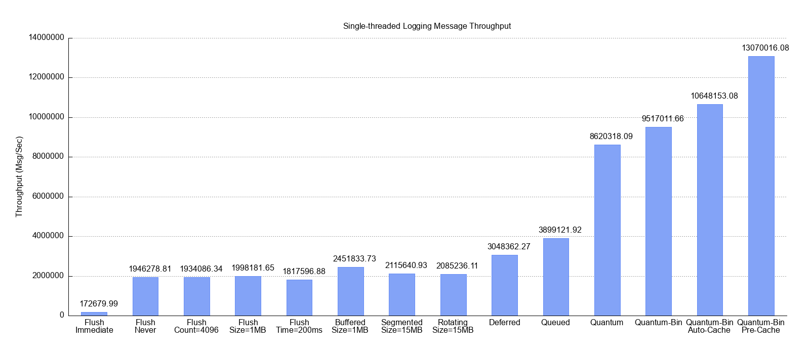

# ELog Logging Library

The ELog (Error Log) library is a simple, lightweight, yet robust, high-performant and feature-rich C++ logging library.  
The library was designed such that it can be extended for a broad range of use cases, and it supports a wide range of options for configuration from file or connection string (see examples below).

The project is still in pre-Beta phase, and more is expected to come.

## Basic Examples

Simple [logging macros](#logging-macros):

    ELOG_INFO("App starting");
    ELOG_INFO("This is an unsigned integer %u and a string '%s'", 5, "hi");

Possible output:

    2025-07-05 10:35:18.311 INFO   [32680] This is an unsigned integer 5 and a string 'hi'

Logging with a designated [logger](#defining-log-sources-and-loggers) (no error checking):

    // initialize a thread-safe shared logger
    elog::ELogSource* logSource = elog::defineLogSource("core");
    elog::ELogLogger* logger = logSource->createSharedLogger();

    // user logger with ELOG_xxx_EX macro family:
    ELOG_INFO_EX(logger, "Obtained a logger from source %s with id %u",
            logSource->getQualifiedName(), 
            logSource->getId());

Initialize elog and configure an asynchronous rotating file log target (log segment size 4M, 20 log segments at most):

    elog::initialize();
    elog::configureTargetFromStr(
        "async://quantum?quantum_buffer_size=1000 | "
        "file:///./app.log?file_segment_size_mb=4&file_segment_count=20");

    // all log messages are now directed to the asynchronous rotating logger
    ELOG_INFO("App starting");

Add asynchronous log target to send log lines to Grafana-Loki, while flushing each 100 log lines or 5 seconds, and restricting log shipping to ERROR log level:

    elog::configureTargetFromStr(
        "async://quantum?quantum_buffer_size=1000&log_level=ERROR | "
        "mon://grafana?mode=json&"
        "loki_endpoint=http://192.168.108.111:3100&"
        "labels={\"app\": \"${app}$\"}&"
        "log_line_metadata={\"log_source\": \"${src}\", \"thread_name\": \"${tname}\"}&"
        "flush_policy=((count == 100) OR (time == 5000))");

Each log line is accompanied by:

- "app" label, which equals to configured application name (see [field reference tokens](#log-record-field-reference-tokens) for more details)
- Log line metadata, containing the log source and thread name issuing the log message

When stack trace are enabled, a stack trace containing file and line can be dumped (so when Grafana-Loki connector is configured, for instance, this stack trace is sent to Grafana-Loki as well):

    ELOG_STACK_TRACE_EX(logger, elog::ELEVEL_INFO, "", 0, "Testing current thread stack trace");

Sample output (Linux):

    2025-07-07 09:53:14.816 INFO   [46748] {main} <elog_root> [Thread 46748 (0xb69c) <main> stack trace]
 
    0# 0x716a4879e618 dbgutil::printStackTraceContext() +185   at dbg_stack_trace.cpp:185 (libdbgutil.so)
    1# 0x716a4903b8cf dbgutil::printStackTrace() +46           at dbg_stack_trace.h:238 (libelog.so)
    2# 0x716a4903b1c1 elog::ELogSystem::logStackTrace() +101   at elog_system.cpp:1527 (libelog.so)
    3# 0x5c4bddcbfb30 initRecovery() +973                      at waL_test.cpp:299 (wal_test_linux)
    4# 0x5c4bddcbeb04 testLoadWALRecord() +120                 at waL_test.cpp:122 (wal_test_linux)
    5# 0x5c4bddcbe96d runTest() +51                            at waL_test.cpp:95 (wal_test_linux)
    6# 0x5c4bddcbe8da main() +389                              at waL_test.cpp:74 (wal_test_linux)
    7# 0x716a4842a1ca N/A                                      at <N/A>  (libc.so.6)
    8# 0x716a4842a28b __libc_start_main()                      at <N/A>  (libc.so.6)
    9# 0x5c4bddcba745 _start() +37                             at <N/A>  (wal_test_linux)

It is also possible to dump stack trace of all running thread (experimental):

    ELOG_APP_STACK_TRACE_EX(logger, elog::ELEVEL_INFO, "", 0, "Testing application stack trace");

Configure [log line format](#configuring-log-line-format):

    elog::configureLogFormat("${time} ${level:6} [${tid}] ${src} ${msg}");

The effect is the following line format:

- time stamp
- followed by log level aligned to the left using width of 6 characters
- followed by thread id, log source name and log message

## Features

The ELog library provides the following notable features:

- Synchronous and asynchronous logging schemes
    - **Lock-free** synchronous log file rotation/segmentation
    - Allowing for multiple log targets (i.e. "log appenders"), including file, syslog, stderr, stdout
- Flexible and rich in features
    - Configurable logger hierarchy, log line format, flush policies, filtering, rate limiting, compound log targets and more
    - **Supports dumping to log call stack (current thread or all threads) with file and line number, voluntarily or due to unhandled signal**
- High performance
    - **160 nano-seconds latency** using Quantum log target (asynchronous lock-free, scalable in multi-threaded scenarios)
    - Check out the [benchmarks](#Benchmarks) below
- Connectivity to external systems
    - [Grafana Loki](https://grafana.com/oss/loki/)
    - [Sentry](https://sentry.io/welcome/)
    - [Datadog](https://www.datadoghq.com/)
    - [Kafka](#connecting-to-kafka-topic)
    - [PostgreSQL](#connecting-to-postgresql)
    - [SQLite](#connecting-to-sqlite)
    - [MySQL](#connecting-to-mysql-experimental)
- Multiple platform support
    - **Linux, Windows, MinGW**
- Designed for external extendibility
    - Special connectors can be developed by the user and get registered into the ELog system
- Configurable from file or properties map
    - Most common use case scenarios are fully configurable from config file

Additional features:

- Logging to multiple targets (destinations) at once
- Logger hierarchy with per-logger log level control
- Various asynchronous logging schemes (low logger latency)
- Configurable log line format and log level on a per-target basis
    - For instance, when using both file and syslog logging, log lines sent to syslog can be formatted differently than regular log file
    - In addition, it can be configured such that only FATAL messages are sent to syslog
- Optional rate limiting (global and/or per log target)
- Configurable flush policy (global and/or per log target)
- Configurable log filtering (global and/or per log target)

Planned/considered future features:

- Connectivity to Windows Event Log
- Connectivity to SMTP
- Support on MacOS
- Optional handling of signals
- Connectivity to external TCP/UDP receiver
- Inverse connector with TCP/UDP server and multicast publish beacon (for embedded systems with no IP known in advance)
- Shared memory log target with separate child logging process (for instrumentation scenarios where opening log file is not allowed)

## Common Use Cases

### Logging Library

The most common use case is a utility logging library, in order to write log messages to file, but much more can be done with it.  
For instance, it can be rather easily extended to be hooked to an external message queue, while applying complex message filtering and transformations. One such extension, namely Kafka Connector, is already implemented built-in.  
This could be useful for DevOps use cases.

### Log Flooding

One more use case is a bug investigation that requires log flooding.  
In this case, sending messages to a log file may affect application timing and hinder bug reproduction during heavy logging.  
For such a situation there is a specialized log target (ELogQuantumTarget), which is designed to minimize the logging latency, by using a lock-free ring buffer and a designated background CPU-bound thread that logs batches of log messages.  
Pay attention that simply using a queue guarded by a mutex is not scalable (check out the [benchmark](#multi-threaded-asynchronous-file-log-target-comparison) below).

### External Systems Connectivity

The ELog system also allows directing log messages to several destinations, so tapping to external log analysis tools, for instance, in addition to doing regular logging to file, is also rather straightforward.  
See [dependencies](#external-dependencies) below for a comprehensive list of external systems integrated with elog out of the box.

### Library Development

One more use case is when developing infrastructure library which requires logging, but the actual logging system
that will be used by the enclosing application is not known (and cannot be known).
In this case, the ELog can be used to log messages inside the library, and the using application may configure
the ELog system to redirect and adapt library log message to its own logging system.
This can be done actually quite easily and with much flexibility.

For more information, see [documentation](#documentation) below.

## Getting Started

In order to use the library, include the main header "elog_system.h", which is the library facade.  
In the application code, make sure to call one of the elog::ElogSystem::initializeXXX() functions before using any of the logging macros. After this, you can use ELOG_INFO() and the rest of the macros.  
At application exit make sure to call elog::ELogSystem::terminate().

### External Dependencies

The ELog system has no special dependencies, unless connecting to one of the external systems listed above.
In particular the following compile/runtime dependencies exist in each case:

- Kafka connector requires librdkafka.so
- PostgreSQL connector requires libpq.so
- SQLite connector requires libsqlite3.so
- MySQL connector requires mysqlcppconn.lib for compile and mysqlcppconn-10-vs14.dll for runtime (Windows only)
- gRPC connector depends on gRPC and protobuf libraries
- Grafana/Loki and Datadog connectors requires json/nlohmann and httplib
- Sentry connector requires the Sentry native library
- Stack trace logging requires [dbgutil](https://github.com/oa-333/dbgutil)

### Installing

The library can be built and installed by running:

    build.sh --install-dir <install-path>
    build.bat --install-dir <install-path>

(Checkout the possible options with --help switch).

Add to compiler include path:

    -I<install-path>/elog/include/elog
    
Add to linker flags:

    -L<install-path>/bin -lelog

According to requirements, in the future it may be uploaded to package managers (e.g. vcpkg).

## Help

See [documentation](#Documentation) section below, and documentation in header files for more information.

## Authors

Oren A. (oa.github.333@gmail.com)

## License

This project is licensed under the Apache 2.0 License - see the LICENSE file for details.

# Documentation

## Contents
- [Basic Usage](#basic-usage)
    - [Initialization and Termination](#initialization-and-termination)
    - [Logging Macros](#logging-macros)
    - [Defining Log Sources and Loggers](#defining-log-sources-and-loggers)
    - [Configuring Log Line Format](#configuring-log-line-format)
    - [Log Record Field Reference Tokens](#log-record-field-reference-tokens)
    - [Extending The Formatting Scheme](#extending-the-formatting-scheme)
    - [Filtering Log Messages](#filtering-log-messages)
    - [Limiting Log Rate](#limiting-log-rate)
    - [Log Targets](#log-targets)
    - [Flush Policy](#flush-policy)
- [Configuring from Properties](#configuring-from-properties)
    - [Configuring Log Level](#configuring-log-level)
    - [Configuring Log Targets](#configuring-log-targets)
    - [Individual Log Target Configuration](#individual-log-target-configuration)
    - [Configuring Flush Policy](#configuring-flush-policy)
    - [Compound Log Targets](#compound-log-targets)
    - [Configuring Database Log Targets](#configuring-database-log-targets)
    - [Connecting to PostgreSQL](#connecting-to-postgresql)
    - [Connecting to SQLite](#connecting-to-sqlite)
    - [Connecting to MySQL (experimental)](#connecting-to-mysql-experimental)
    - [Connecting to Kafka Topic](#connecting-to-kafka-topic)
    - [Connecting to Grafana-Loki](#connecting-to-grafana-loki)
    - [Connecting to Sentry](#connecting-to-sentry)
    - [Connecting to Datadog](#connecting-to-datadog)
    - [Nested Specification Style](#nested-specification-style)
    - [Terminal Formatting Syntax](#terminal-formatting-syntax)
- [Benchmarks](#benchmarks)
    - [Benchmark Highlights](#benchmark-highlights)
    - [Empty Logging Benchmark](#empty-logging-benchmark)
    - [Synchronous File Log Target with Count Flush Policy](#synchronous-file-log-target-with-count-flush-policy)
    - [Synchronous File Log Target with Size Flush Policy](#synchronous-file-log-target-with-size-flush-policy)
    - [Synchronous File Log Target with Time Flush Policy](#synchronous-file-log-target-with-time-flush-policy)
    - [Single-threaded Synchronous File Log Target Comparison](#single-threaded-synchronous-file-log-target-comparison)
    - [Multi-threaded Asynchronous File Log Target Comparison](#multi-threaded-asynchronous-file-log-target-comparison)

## Basic Usage

### Initialization and Termination

The ELog library can be used out of box as follows:

    #include "elog_system.h"
    ...

    int main(int argc, char* argv[]) {
        // initialize the elog system to log into file
        if (!elog::ELogSystem::initializeLogFile("./test.log")) {
            fprintf(stderr, "Failed to initialize elog\n");
            return 1;
        }

        // do application stuff
        ELOG_INFO("App starting");
        ...

        // terminate the elog system
        elog::ELogSystem::terminate();
        return 0;
    }

The example exhibits the main parts of the ELog library:

- Including the ELog library's main facade header "elog_system.h"
- Initialization (in this case using a log file)
- Invoking the logging macros
- Termination

There are several initialization functions, which can all be found in the ELogSystem facade.
In this example a synchronous segmented log file is used, with 4MB segment size:

    #include "elog_system.h"
    ...
    
    #define MB (1024 * 1024)

    int main(int argc, char* argv[]) {
        // initialize the elog system to log into segmented file
        if (!elog::ELogSystem::initializeSegmentedLogFile(
                ".",        // log dir
                "test",     // segment base name
                4 * MB)) {  // segment size
            fprintf(stderr, "Failed to initialize elog\n);
            return 1;
        }

        // do application stuff
        ELOG_INFO("App starting");
        ...

        // terminate the elog system
        elog::ELogSystem::terminate();
        return 0;
    }

### Logging Macros

The ELog system defines utility macros for logging.  
One group of macros requires a logger, and another group of macros does not.  
This is the easiest form of logging, without any logger defined:

    ELOG_INFO("Sample message with string parameter: %s", someStr);

In order to specify a logger, use the ELOG_xxx_EX() macro set, as follows:

    ELOG_INFO_EX(logger, "Sample message with string parameter: %s", someStr);

### Defining Log Sources and Loggers

One of the main entities in the ELog system is the Log Source.  
It serves as a semantic module entity.  
From one Log Source many loggers can be obtained, one for each logging class/file.
A logger is the logging client's end point, with which log messages are partially formatted,  
before being sent to log targets for actual logging.

Here is a simple example of defining a log source and obtaining a logger.

    using namespace elog;
    ELogSource* logSource = ELogSystem::defineLogSource("core");
    if (logSource == nullptr) {
        // NOTE: we use here the default logger
        ELOG_ERROR("Failed to define log source with name core");
    } else {
        ELogLogger* logger = logSource->createSharedLogger();
        ELOG_INFO_EX(logger, "Obtained a logger from source %s with id %u",
            logSource->getQualifiedName(), 
            logSource->getId());
    }

Log sources form a tree hierarchy according to their qualified name, which is separated by dots.  
The root log source has an empty name, and does not have a dot following its name, so that second level  
log sources have a qualified name that is equal to their bare name.

The log level of each log source may be controlled individually.  
The log level of a log source affects all log sources underneath it, unless they specify a log level separately.  
For instance, suppose the following log source hierarchy is defined:

    core
    core.files
    core.thread
    core.net

The core log source may define log level of NOTICE, but the core.thread log level may define log level TRACE.  
The core.files, and core.net log sources will inherit the NOTICE level from the core parent log source.

In order to enable better level of control over the log level of the log source hierarchy, the log source  
provides the setLogLevel() method, which allows specifying how to propagate the log level to child log sources:

    void setLogLevel(ELogLevel logLevel, ELogPropagateMode propagateMode);

In particular there are 4 propagation modes:

- none: No log level propagation takes place at all.
- set: Each descendant log source inherits the log level of the log source ancestor
- restrict: Each descendent log source cannot have less restrictive log level than the log source ancestor
- loose: Each descendent log source cannot have more restrictive log level than the log source ancestor

This allows for more flexibility in configuring the log source tree.

### Configuring Log Line Format

The ELog system allows configuring log line format using a format specification string that supports special log field reference tokens.  
For instance, the default log line format specification that is used by ELog is:

    ${time} ${level:6} [${tid}] ${msg}

In code, it can be done as follows:

    elog::ELogSystem::configureLogFormat("${time} ${level:6} [${tid}] ${msg}");

In configuration (globally or per log target), it can be done as follows:

    log_format=${time} ${level:6} [${tid}] ${msg}

This format in reality gets expanded to something like this:

    2025-04-08 11:40:58.807 INFO   [49108] Thread pool of 10 workers started

We see here all 4 components expanded:

- logging time
- log level (aligned to the left with width of 6 characters)
- logging thread id, enclosed with brackets
- formatted log message

### Log Record Field Reference Tokens

The following special log field reference tokens are understood by the ELog system:

- ${rid} - the log record id.
- ${time} - the logging time.
- ${host} - the host name.
- ${user} - the logged in user.
- ${os_name} - the operating system name.
- ${os_ver} - the operating system version.
- ${app} - configurable application name.
- ${prog} - the program name (extracted from executable image file name).
- ${pid} - the process id.
- ${tid} - the logging thread id.
- ${tname} - the logging thread name (requires user collaboration).
- ${level} - the log level.
- ${file} - The logging file name.
- ${line} - The logging line.
- ${func} - The logging function.
- ${src} - the log source of the logger (qualified name).
- ${mod} - the alternative module name associated with the source.
- ${msg} - the log message.

Tokens may contain justification number, where positive means justify to the left,  
and negative number means justify to the right. For instance: ${level:6}, ${tid:-8}.

An extended syntax for reference token was defined for special terminal formatting escape sequences (colors and fonts).
See 

### Extending The Formatting Scheme

In order to extend the formatting scheme with new reference tokens, ELogFieldSelector should be derived, implemented, and registered.  
For instance:

    class MyFieldSelector : public ELogFieldSelector {
    public:
        MyFieldSelector(int justify, ...) : ELogFieldSelector(ELogFieldType::FT_INT, justify) {...}
        ~MyFieldSelector() override {...}

        void selectField(const ELogRecord& record, ELogFieldReceptor* receptor) final {
            // implement
            // obtain the data and pass it to the receptor, with justify value. For instance:
            uint64_t myIntData = ...;
            receptor->receiveIntField(myIntData, m_justify);
        }

    private:
        ELOG_DECLARE_FIELD_SELECTOR(MyFieldSelector, refname);
    };

Pay attention that now, in the format line configuration you may reference this new token with ${refname},  
as specified in the ELOG_DECLARE_FIELD_SELECTOR() macro.

In addition, in the source file, make sure the implement the field selector registration, as follows:

    ELOG_IMPLEMENT_FIELD_SELECTOR(MyFieldSelector)

For more examples see elog_field_selector.h and elog_field_selector.cpp.

### Filtering Log Messages

By default, all messages are logged, but in some use cases, it may be required to filter out some log messages.
In general, the log level may be used to control which messages are logged, and this may be controlled at
each log source. There are some occasions that more fine-grained filtering is required.
In this case ELogFilter may be derived to provide more specialized control.

Pay attention that log filtering is usually applied at the global level, by the call:

    ELogSystem::setLogFilter(logFilter);

### Limiting Log Rate

A special instance of a log filter is the rate limiter, which may be applied globally or per log-target:

    ELogRateLimiter* rateLimiter = new ELogRateLimiter(500);  // no more than 500 messages per second
    ELogSystem::setLogFilter(rateLimiter);

### Log Targets

Log targets are where log records are sent to after being partially formatted (and filtered).
The log target usually performs final formatting and writes the formatted log message to a file.
But, as mentioned above, much more can be done.

So, first the ELogFileTarget is defined for simple logging to file, in the logger's context.
In addition, the ELogSegmentedFileTarget is defined for segmented logging, where the segment size
can be specified.

If it is required to avoid logging (and possibly flushing, see below), on the logger's context, 
it is possible to defer that to another context by using the ELogDeferredTarget.
This log target takes another target as the final destination:

    // define a segmented log target with 4K segment size
    ELogTarget* fileTarget = new ELogSegmentedFileTarget("logs", "app.log", 4096, nullptr);

    // combine it with a deferred log target
    ELogTarget* deferredTarget = new ELogDeferredTarget(fileTarget);

    // now set it as the system log target
    ELogSystem::setLogTarget(deferredTarget);

The ELogDeferredTarget is quite simplistic. It wakes up the logging thread for each log message.
The ELogQueuedTarget provides more control, by allowing to specify a batch size and a timeout,
so the logging thread wakes up either when the queued number of log messages exceeds some limit, or that 
a specified timeout has passed since last time it woke up.
In the example above we can change it like this:

    // define a segmented log target with 4K segment size
    ELogTarget* fileTarget = new ELogSegmentedFileTarget("logs", "app.log", 4096, nullptr);

    // combine it with a queued log target with batch size 64, and 500 milliseconds timeout
    ELogTarget* queuedTarget = new ELogQueuedTarget(fileTarget, 64, 500);

    // now set it as the system log target
    ELogSystem::setLogTarget(queuedTarget);

The ELogQuantumTarget mentioned above can be use das follows:

    // define a segmented log target with 4K segment size
    ELogTarget* fileTarget = new ELogSegmentedFileTarget("logs", "app.log", 4096, nullptr);

    // combine it with a quantum log target that can handle a burst of 1 million log messages
    ELogTarget* quantumTarget = new ELogQuantumTarget(&fileTarget, 1024 * 1024);

    // now set it as the system log target
    ELogSystem::setLogTarget(quantumTarget);

The ELogSQLiteDbTarget can be used as follows:

    ELogTarget* sqliteTarget = new ELogSQLiteDbTarget("test.db", "INSERT INTO log_records values(${rid}, ${time}, ${level}, ${host}, ${user}, ${prog}, ${pid}, ${tid}, ${mod}, ${src}, ${msg})");

    // add it as an additional log target
    ELogSystem::addLogTarget(sqliteTarget);

### Flush Policy

As some log targets may require flushing (as in file, or any buffered channel), a policy can be defined.
By default, all log targets flush after each message logging.
This strategy is implemented by the ELogImmediateFlushPolicy class.

It may be preferred to avoid flushing altogether.  
This strategy is implemented by the ELogNeverFlushPolicy class.

It may be preferred to flush every X messages.
For this case the ELogCountFlushPolicy can be used.

Another strategy is to flush whenever the amount of logged data exceeds some size limit.
For this case the ELogSizeFlushPolicy can be used.

If a timeout is required (without using a deferred log target), the ELogTimedFlushPolicy can be used.
This is an active policy, which launches a designated thread for this purpose.

In case a combination of strategies is needed, either ELogAndFlushPolicy or ELogOrFlushPolicy can be used.

For any other specialized flush policy, derive from ELogFlushPolicy and override the shouldFlush() virtual method.

## Configuring from Properties

The ELogSystem facade provides a utility function to load configuration from properties map:

    static bool configureFromProperties(const ELogPropertyMap& props,
                                        bool defineLogSources = false,
                                        bool defineMissingPath = false);

The properties map is actually a vector of pairs, since order of configuring log sources' log levels matter.  
The following properties are recognized (the rest are ignored):

- log_format: configures log line format specification
- log_level: configures global log level of the root log source, allows specifying propagation (see below)
- {source-name}.log_level: configures log level of a specific log source
- log_rate_limit: configures the global log rate limit (maximum number of messages per second)
- log_target: configures a log target (may be repeated several times)

### Configuring Log Level

The log level configuration items follow the following syntax:

    <log-level-string><propagation-spec>

The log level string is any one of the following:

    FATAL
    ERROR
    WARN
    NOTICE
    INFO
    TRACE
    DEBUG
    DIAG

The propagation specification could be empty, or any one of the following:

    * (asterisk sign): specifies to propagate the log level as is to all descendant log sources
    + (plus sign): specifies permissive (loose) log level propagation
    - (minus sign): specifies restrictive log level propagation

So, continuing the example above, we can define that the entire core module has INFO log level,  
but the files sub-module will have TRACE log level:

    core.log_level = INFO*
    core.files.log_level = TRACE*

Now suppose that for a short while we would like to investigate some bug in the core module,  
but we would like to avoid setting the files sub-module level to DEBUG, since it is really noisy,  
and it is not related to the bug we are investigating. The simplest way to do this is as follows:

    core.log_level = DEBUG+
    core.files.log_level = TRACE-

The above configuration ensures all core log sources have at least DEBUG log level (if any log source  
had a more permissive log level, then its log level is kept intact), but after that the cores.files  
module log level is restricted to TRACE, including all sub-packages.  
Pay attention that order matters here.

### Configuring Log Targets

As mentioned above, log targets can be configured using properties.  
The following syntax is supported:

    sys://stdout - add log target to standard output stream
    sys://stderr - add log target to standard error stream
    sys://syslog - add log target to syslog (or Windows event log, when running on Windows)
    file://path - add regular log target
    file://path?file_segment_size_mb=<file-segment-size-mb> - add segmented file log target
    db://provider?conn_string=<url>&insert_query=<insert-query>...
    msgq://provider?... (see example below for more details)
    rpc://provider?rpc_server=<host:port>&rpc_call=<function-name>(<param-list>)

Log targets may be assigned a name for identification, if further special configuration is required.  
Target name may be specified by the 'name' parameter, as follows:

    file://path?name=file-logger

Next, the log target may be located as follows:

    ELogTarget* logTarget = ELogSystem::getLogTarget("file-logger");

### Individual Log Target Configuration

The log line format and the log level of each target can be configured separately. For instance:

    log_target = sys://syslog?log_level=FATAL&log_format=${level:6} ${prog} ${pid} [${tid}] <${src}> ${msg}
    log_target = sys://stderr?log_level=ERROR&log_format=***ERROR*** ${time} ${level:6} ${msg}

Pay attention that the rest of the log targets will use the global log level and line format configuration.

### Configuring Flush Policy

Log targets can be assigned a flush policy (file targets by default flush after every message).
The flush policy can be configured as follows:

    flush_policy=none|immediate|never|count|size|time

Where each value designates a different policy:

- none: no flushing is specified, behavior is determined by each log target separately
- immediate: orders to flush log target after each log message sending
- never: orders to avoid flushing the log target altogether, except for during shutdown
- count: Order to flush log target after a configured amount of log messages has been sent
- size: Order to flush log target after a configured amount of bytes of log messages has been sent
- time: Order to flush log target after a configured amount of time passed since last flush took place

The last three flush policies require the following addition parameter each respectively:

- flush_count
- flush_size_bytes
- flush_timeout_millis

For more complex flush policy, assign a name to the log target and configure manually its flush policy.

### Compound Log Targets

The following optional parameters are supported for compound log targets:

    defer (no value associated)
    queue_batch_size=<batch-size>,queue_timeout_millis=<timeout-millis>
    quantum_buffer_size=<buffer-size>

These optional parameters can be used to specify a compound deferred or queued log target.  
The defer option specifies a deferred log target.  
The queue options specify a queued log target.  
The quantum option specifies a quantum log target.  
All options should be separated by an ampersand (&).

Here is an example for a deferred log target that uses segmented file log target:

    log_target = file://logs/app.log?file_segment_size_mb=4&deferred

### Configuring Database Log Targets

Here is another example for connecting to a MySQL database behind a queued log target:

    log_target = db://mysql?conn_string=tcp://127.0.0.1&db=test&user=root&passwd=root&insert_query=INSERT INTO log_records values(${time}, ${level}, ${host}, ${user}, ${prog}, ${pid}, ${tid}, ${mod}, ${src}, ${msg})&queue_batch_size=1024&queue_timeout_millis=100

Pay attention to the last log target example components:

- scheme: db
- path: mysql (designates the database type)
- conn_string: The connection string (url in MySQL terminology)
- db: The MySQL db schema being connected to
- user: The user name used to connect to the database
- passwd: The password used to connect to the database (for security put the configuration file in a directory with restricted access)
- insert_query: The query used to insert a log record into the database
- queue_batch_size: When this is present a queued log target is used
- queue_timeout_millis: Specifies the timeout used by the queued log target

In the example above, queue_batch_size and queue_timeout_millis are not related to the database target specification,  
and their presence only configures a compound log target (namely, a queued log target over a database lgo target).  

When using the db scheme, the conn_string and insert_query components are mandatory.
The following parameters are optional for database target configuration:

- db_thread_model: Specified how the database should be accessed by multiple threads concurrently. Possible values:
    - none: No thread-model is in use.  
        User code is responsible for managing multi-threaded access to database log target.
    - lock: A single lock is used to serialize all access to db log target.  
        This is thread-safe but will not scale well, and may be suitable for simple multi-threaded scenarios.
    - conn-per-thread: Each thread is allocated a separate connection, and no lock is used.
        This is a thread-safe and scalable.
- db_max_threads: When specifying db_thread_model=conn-per-thread it is possible also to configure the maximum  
    number of threads expected to concurrently send log messages to the database log target.  
    If not specified, then a default value of 4096 is used.
- db_reconnect_timeout_millis: When using database log target, a background thread is used to reconnect to the  
    database after disconnect. This value determines the timeout in milliseconds between any two consecutive reconnect attempts.

Additional required components may differ from one database to another.

### Connecting to PostgreSQL

Here are the required parameters for connecting to PostgreSQL:

    db://postgresql?conn_string=localhost&port=5432&db=mydb&user=oren&passwd=1234&insert_query=INSERT INTO log_records values(${rid}, ${time}, ${level}, ${host}, ${user}, ${prog}, ${pid}, ${tid}, ${mod}, ${src}, ${msg})

Here are the relevant components:

    - scheme: db
    - path: postgresql
    - conn_string: simply denotes the host name/ip.
    - port: the server port (note, unlike MySQL, this is passed separately, and not as part of the connection string)
    - user: The user name used to connect to the database
    - passwd: The password used to connect to the database (for security put the configuration file in a directory with restricted access)
    - insert_query: The query used to insert a log record into the database

In this example there is no compound log target specification.

### Connecting to SQLite

Following is a sample configuration for SQLite connector:

    db://sqlite?conn_string=wal.db&insert_query=INSERT INTO log_records values(${rid}, ${time}, ${level}, ${host}, ${user}, ${prog}, ${pid}, ${tid}, ${mod}, ${src}, ${msg})

Here are the relevant components:

    - scheme: db
    - path: sqlite
    - conn_string: denotes the path to the DB file on disk.
    - insert_query: The query used to insert a log record into the database

### Connecting to MySQL (experimental)

Following is a sample configuration for SQLite connector:

    db://mysql?conn_string=tcp://127.0.0.1&db=test&user=root&passwd=root&insert_query=INSERT INTO log_records values(${time}, ${level}, ${host}, ${user}, ${prog}, ${pid}, ${tid}, ${mod}, ${src}, ${msg})

Here are the relevant components:

    - scheme: db
    - path: mysql
    - conn_string: denotes the server address (host and port)
    - db: denotes the database name
    - user: the user name used to login to the database
    - passwd: the password used to login to the database
    - insert_query: The query used to insert a log record into the database

### Connecting to Kafka Topic

The following example shows how to connect to a Kafka topic:

    log_target = msgq://kafka?kafka_bootstrap_servers=localhost:9092&msgq_topic=log_records

The kafka log target uses the 'msgq' scheme, and 'kafka' provider.  
Two mandatory parameters are expected: 'kafka_bootstrap_servers' and 'msgq_topic'.  
Optionally, a partition id may be passed as well with the syntax 'partition={id}, and also msgq_headers (see below).  
Pay attention that in the example above, the global log format is used as the message payload.  
If a more specialized message pay load is required, then add a 'log_format' parameter to the log target configuration.

In case a flush policy is used, then the flush timeouts, both during regular flush, and during shutdown flush,  
can be configured via 'kafka_flush_timeout_millis' and 'kafka_shutdown_flush_timeout_millis' respectively:

    log_target = msgq://kafka?kafka_bootstrap_servers=localhost:9092&msgq_topic=log_records&kafka_flush_timeout_millis=50&flush_policy=immediate

Pay attention that the flush_policy parameter enforces kafka message flush after each message is being produced.  
Different flush policies can be applied, as explained above.

In case message msgq_headers are to be passed as well, the 'msgq_headers' parameter should be used as a CSV property list:

    log_target = msgq://kafka?kafka_bootstrap_servers=localhost:9092&msgq_topic=log_records&msgq_headers=rid=${rid}, time=${time}, level=${level}, host=${host}, user=${user}, prog=${prog}, pid=${pid}, tid=${tid}, tname=${tname}, file=${file}, line=${line}, func=${func}, mod=${mod}, src=${src}, msg=${msg}

Since log target resource strings tend to get complex, future versions will include property trees for configuration.

### Nested Specification Style

As log target URLs tend to be rather complex in some cases, a different specification style was devised, namely nested style.
For instance, let's take the last example (sending log messages to Kafka topic with headers), but let's put it behind a deferred
log target. The result looks like this:

    log_target = msgq://kafka?kafka_bootstrap_servers=localhost:9092&msgq_topic=log_records&msgq_headers=rid=${rid}, time=${time}, level=${level}, host=${host}, user=${user}, prog=${prog}, pid=${pid}, tid=${tid}, tname=${tname}, file=${file}, line=${line}, func=${func}, mod=${mod}, src=${src}, msg=${msg}&deferred

This is rather not pleasing to the eye, and probably prone to error.  
Instead here is how it may look using the nested specification style:

    log_target = {
        scheme = async,
        type = deferred,
        log_target = {
            scheme = msgq,
            type = kafka,
            kafka_bootstrap_server = localhost:9092,
            msgq_topic = log_records,
            msgq_headers = rid=${rid}, time=${time}, level=${level}, host=${host}, user=${user}, prog=${prog}, pid=${pid}, tid=${tid}, tname=${tname}, file=${file}, line=${line}, func=${func}, mod=${mod}, src=${src}, msg=${msg}
        }
    }

With this type of log target specification, the log target nesting is much clearer. In this example, it is evident that log messages are handed over to a deferred log target, which in turn sends log messages to a kafka topic.

Besides clarity, the nested specification style allows doing things which are not possible with URL style.  
For instance, suppose we have a syslog target configured with log level ERROR, but some module, say core.files, reports many errors due to disk failure, and causes log flooding in syslog. As a result, we would like to restrict the rate of this specific log source to syslog (assume we don't care about other log targets) to 10 messages per second, but we would not like to restrict other log sources. This can be achieved in configuration with compound log filters as follows:

    log_target = {
        scheme = sys,
        path = syslog,
        log_level = ERROR,
        filter = OR,
        filter_args = [
            {
                filter = NOT,
                filter_args = {
                    filter = log_source_filter,
                    log_source = core.files
                }
            },
            {
                filter = rate_limiter,
                max_msg_per_sec = 10
            }
        ]
    }

The logic this configuration uses is as follows: allow messages to pass if the log source is NOT core.files OR (i.e. the log source is core.files) the rate does not exceed 10 messages per second. In any case the log level is set at ERROR for syslog.  
This example is a bit complex, but it illustrates the flexibility nested configuration has.

In case of simply limiting the rate for all incoming messages, the configuration becomes much simpler:

    log_target = {
        scheme = sys,
        path = syslog,
        log_level = ERROR,
        filter = rate_limiter,
        max_msg_per_sec = 10
    }

### Terminal Formatting Syntax

When logging to terminal (stdout or stderr), it is possible to specify special formatting for the log line.  
For instance, consider the following log target specification:

    "sys://stderr?log_format=${time:text=faint} ${level:6:fg-color=green:bg-color=blue} "
        "[${tid:text=italic}] ${src:text=underline:fg-color=bright-red} "
        "${msg:text=cross-out,blink-rapid:fg-color=#993983}";

Here is the breakdown of this configuration URL:

- The time part is in faint (opposite of bold) font
- Log level color is green, and background is blue
- Thread id field is in italic font
- Log source name is underlined, and having bright red color
- The message has cross-out (strike-through, not supported on all terminals)
- The message blinks rapidly and has magenta like color specified by RGB value #993983

Following is the output in VSCode console:

Conditional formatting is supported as well. For instance:

    "sys://stderr?log_format=${time:text=faint} "
        "${if: (log_level == INFO): ${fmt:begin-fg-color=green}: ${fmt:begin-fg-color=red}}"
        "${level:6}${fmt:default} "
        "[${tid:text=italic}] ${src:text=underline:fg-color=bright-red} "
        "${msg:text=cross-out,blink-rapid:fg-color=#993983}";

In this example, the log level color is green in case the log level is INFO, otherwise it is red.
This is how it looks on VSCode console:

Please note that:

- Conditional formatting is specified with ${if ...} special syntax
- Formatting uses ${fmt ...} special syntax
- Formatting is reset to default with ${fmt:default}

Following is a formal specification of the terminal formatting syntax.

### Terminal Formatting Formal Syntax Specification

The extended reference token syntax follows the general form:

    ${<field-name>:<colon separated list of format specifiers>}

The field-name could be any one of the [predefined reference token names](#log-record-field-reference-tokens).  
It could also be \${fmt} which exists only for formatting purposes (no text emitted, only ANSI C escape sequences).  
Additional field names are for conditional formatting: \${if}, \${switch}, \${expr-switch}.

The format specifier list could be any of the following, and may be repeated (overriding previous specification):

    justify-left = <justify-count>
    justify-right = <justify-count>
    fg-color = <color-specification>
    bg-color = <color-specification>
    font = <font-specification>
    <positive integer value for left justification>
    <negative integer value for right justification>

The color specification may be specified in any of the following ways:

- Simple color: black, red, green, yellow, blue, magenta, cyan, white
- Bright color may be specified with "bright" prefix: bright-red, bright-blue, etc.
- VGA color: vga#RRGGBB where each pair is a hexadecimal value specifying component intensity, and cannot exceed 1F
- Gray-scale color: grey#<0-23>, or gray#<0-23>, where the value in the range [0-23] specifies the intensity, zero being dark, and 23 being light
- SVGA RGB color: #RRGGBB where each pair is a hexadecimal value specifying component intensity
- Font type: bold/faint/normal, italic/no-italic, underline/no-underline, cross-out/no-cross-out (strike-through/no-strike-through), slow-blink/rapid-blink/no-blink

Note that strike-through is a synonym for cross-out, although it has not been possible to observe this formatting in effect.

#### Spanning Formatting over Several Fields

When specifying formatting within a field reference token, the formatting applies only to that field, and formatting is automatically reset to default for the rest of the formatted log message.  
If it is desired to span formatting over a few fields, then the "begin" prefix may be used, terminated with a default/reset specifier:

    ${time:font=begin-bold} [${level:6:font=default}]

In this example, both time and level have bold font.
It is possible to use pure formatting reference token instead:

    ${fmt:font=begin-bold}${time} [${level:6}]${fmt:default}

Here is where usage of normal, no-italic, no-underline, etc. makes sense:

    ${fmt:font=begin-bold,begin-italic}${time} [${level:6}]${fmt:normal}

When 'normal' (resets bold/faint specification) is specified, 'italic' is still in effect.

#### Conditional Formatting Syntax

Conditional formatting takes place in three main forms:

    
    ${if: (filter-pred): ${name:<true format>} [: ${name:< false format>}] }
    ${switch: (expr): ${case: (expr) : ${fmt:<format>}}, ..., ${default:${fmt: <format>}} }
    ${expr-switch: ${case: (filter-pred) : ${fmt:<format>}}, ..., ${default:${fmt: <format>}} }

TODO: finish this after documenting filter predicates.

## Benchmarks

The following unofficial benchmarks results illustrate the high performance of the ELog library.  

The benchmark is divided into four parts:

- Test the impact of empty logging with private and shared logger
- Search for best configuration of each flush policy (count, size, time)
- Single-threaded comparison of all log targets (file, async file)
- Multi-threaded scaling of each tested configuration

All multi-threaded tests were conducted with each thread hammering its own private logger.
Shared logger multi-threaded tests are provided only for the quantum log target.

All tests were performed on Windows, compiling with g++ for MinGW, running under MSYSTEM console.  
All tests were conducted on commodity hardware.

Please note that all benchmarks calculate the average value and not percentiles.  
The reason for that is that collecting each sample time affected greatly the test, reducing performance up to 20%.  
Since there is no interaction with external system (at least in this benchmark), only averages are presented,  
as outliers are not expected.

### Benchmark Highlights

The following table summarizes the main KPIs of the ELog library:

| KPI | Value |
|:---|---:|
| Private Logger Latency (no log issued) | 0.2 nano-seconds |
| Shared Logger Latency (no log issued) | 1.3 nano-seconds |
| Synchronous Logging Throughput (flush each message) | 163444 Msg/Sec |
| Synchronous Logging Throughput (delayed flush) | 2.4 Million Msg/Sec |
| Asynchronous Logging Throughput* (single-threaded) | 6.4 Million Msg/Sec |
| Asynchronous Logging Latency (single-threaded) | 156 nano-seconds |

NOTE: Asynchronous logging throughput refers to the logger's capacity to push messages to the end log target, not to the throughput of disk writing.

### Empty Logging Benchmark

The first benchmark checked the impact of using the logging macros without logging (i.e. when log level does not match).  
Separate tests were conducted with a shared logger and a private logger.  
The private logger, as expected, performs slightly better (due to thread local access in shared logger).  
The benchmark test results illustrate that:

| Logger    | Throughput (Msg/Sec)  |
|:----------|----------------------:|
| Private   | 5000000000.000        |
| Shared    |  769230769.231        |

So although both exhibit very low impact (10000 messages took 2 and 13 microseconds respectively),  
the private is clearly performing better (X6.5 times faster).  
Note that the latency on the logging application is minimal: 0.2 and 1.3 nano-seconds on private and shared logger respectively. 

### Synchronous File Log Target with Count Flush Policy

Following are the benchmark test results for synchronous file log target with flush_policy=count, setting varying count values:

As it can be seen, flush_count=512 and flush_count=1024 both yield the best results (around 2.4 Million messages per second), and setting a higher number does need yield any better results.  
Most probably this has to do with underlying system file buffers.  
NOTE: Doing direct/async I/O is not being considered at this time.

### Synchronous File Log Target with Size Flush Policy

Following are the benchmark test results for synchronous file log target with flush_policy=size, setting varying size values:

The results of this test are rather illuminating.
First, we can conclude that setting buffer size of 64KB yields top results, peaking at around 2.2 Million messages per second.
Second, increasing the buffer size does not have any notable effect.  
Again, this is most probably related to the underlying system file buffers.

### Synchronous File Log Target with Time Flush Policy

Following are the benchmark test results for synchronous file log target with flush_policy=time, setting varying time values:

The results here shows that a flush period of 500 ms and 1000ms yield the best results, but the differences are not so clear.  
This again probably has to do with underlying buffer size, and the right timing to flush them (not too early and not too late).

### Single-threaded Synchronous File Log Target Comparison

In the following bar chart, all synchronous file log target configurations are compared together:

This last comparison needs further explanation:

- The 'immediate' policy flushes after each log message write, and exhibits the lowest performance
- The 'never' policy simply never flushes, and serves as a baseline for other configurations
- All other synchronous logging methods exhibit the same single-threaded performance (around 950,000 messages per second)

The last 3 logging methods are asynchronous and mostly exhibit high performance as expected, but it should be noted that  
this does not relate to disk write performance, but rather to logger throughput.  
In other words, this actually illustrates the logger latency when using asynchronous log target.

Points to note:

- The deferred log target can receive 4.2 Million messages per second, that is an average latency of 238 nano-seconds per message
- The quantum log target can receive 6.4 Million messages per second, that is an average latency of 156 nano-seconds per message
- The queued log target can receive 1.6 Million messages per second, and requires further investigation

All asynchronous loggers were configured with generous buffer sizes for testing peak performance.  
In reality this measures the peak performance during a log message burst.  
So when configuring log targets to withstand the largest message burst, this is the expected performance.

### Multi-threaded Asynchronous File Log Target Comparison

This test checks the scalability of each log target, and the results are interesting:

As the graph depicts, the deferred and queued log targets are not scalable, since both impose a lock,  
whereas the quantum log target employs a lock-free ring buffer.  
The results show that the quantum logger is fully scalable, as much as system resources allow.  
In addition, when using a shared logger (for instance, in a code section that is concurrently accessed by many threads), the quantum logger is still scalable, though slightly lagging behind the private logger performance.